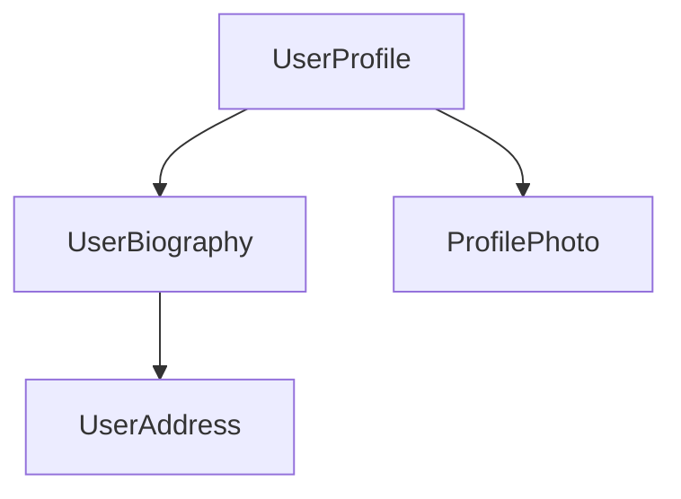

Components are the main building blocks of Angular applications. Each component represents a part of a larger web page. Organizing an application into components helps provide structure to your project, clearly separating code into specific parts that are easy to maintain and grow over time.

## Defining a component

## Table of Contents

  - [Defining a component](#defining-a-component)
  - [Using components](#using-components)
  - [Next Step](#next-step)
- **[Component selectors](#component-selectors)**
  - [Types of selectors](#types-of-selectors)
  - [Choosing a selector](#choosing-a-selector)
- **[Styling components](#styling-components)**
  - [Style scoping](#style-scoping)
  - [Defining styles in templates](#defining-styles-in-templates)
  - [Referencing external style files](#referencing-external-style-files)
- **[Accepting data with input properties](#accepting-data-with-input-properties)**
  - [Reading inputs](#reading-inputs)
  - [Required inputs](#required-inputs)
  - [Configuring inputs](#configuring-inputs)
  - [Model inputs](#model-inputs)
  - [Choosing input names](#choosing-input-names)
  - [Declaring inputs with the `@Input` decorator](#declaring-inputs-with-the-input-decorator)
  - [Specify inputs in the `@Component` decorator](#specify-inputs-in-the-component-decorator)
- **[Custom events with outputs](#custom-events-with-outputs)**
  - [Emitting event data](#emitting-event-data)
  - [Customizing output names](#customizing-output-names)
  - [Subscribing to outputs programmatically](#subscribing-to-outputs-programmatically)
  - [Choosing event names](#choosing-event-names)
  - [Using outputs with RxJS](#using-outputs-with-rxjs)
  - [Declaring outputs with the `@Output` decorator](#declaring-outputs-with-the-output-decorator)
  - [Specify outputs in the `@Component` decorator](#specify-outputs-in-the-component-decorator)
- **[Content projection with ng-content](#content-projection-with-ng-content)**
  - [Multiple content placeholders](#multiple-content-placeholders)
  - [Fallback content](#fallback-content)
  - [Aliasing content for projection](#aliasing-content-for-projection)
  - [Caveats](#caveats)

---


Every component has a few main parts:

1. A `@Component`[decorator](https://www.typescriptlang.org/docs/handbook/decorators.html) that contains some configuration used by Angular.
2. An HTML template that controls what renders into the DOM.
3. A [CSS selector](https://developer.mozilla.org/docs/Learn/CSS/Building_blocks/Selectors) that defines how the component is used in HTML.
4. A TypeScript class with behaviors, such as handling user input or making requests to a server.

Here is a simplified example of a `UserProfile` component.

```typescript
// user-profile.ts
@Component({
  selector: 'user-profile',
  template: `
    <h1>User profile</h1>
    <p>This is the user profile page</p>
  `,
})
export class UserProfile {
  /* Your component code goes here */
}
```

The `@Component` decorator also optionally accepts a `styles` property for any CSS you want to apply to your template:

```typescript
// user-profile.ts
@Component({
  selector: 'user-profile',
  template: `
    <h1>User profile</h1>
    <p>This is the user profile page</p>
  `,
  styles: `
    h1 {
      font-size: 3em;
    }
  `,
})
export class UserProfile {
  /* Your component code goes here */
}
```

### Separating HTML and CSS into separate files

You can define a component's HTML and CSS in separate files using `templateUrl` and `styleUrl`:

```typescript
// user-profile.ts
@Component({
  selector: 'user-profile',
  templateUrl: 'user-profile.html',
  styleUrl: 'user-profile.css',
})
export class UserProfile {
  // Component behavior is defined in here
}
```

```html
<!-- user-profile.html -->
<h1>User profile</h1>
<p>This is the user profile page</p>
```

```css
/* user-profile.css */
h1 {
  font-size: 3em;
}
```

## Using components

You build an application by composing multiple components together. For example, if you are building a user profile page, you might break the page up into several components like this:



Here, the `UserProfile` component uses several other components to produce the final page.

To import and use a component, you need to:

1. In your component's TypeScript file, add an `import` statement for the component you want to use.
2. In your `@Component` decorator, add an entry to the `imports` array for the component you want to use.
3. In your component's template, add an element that matches the selector of the component you want to use.

Here's an example of a `UserProfile` component importing a `ProfilePhoto` component:

```typescript
// user-profile.ts
import {ProfilePhoto} from 'profile-photo.ts';

@Component({
  selector: 'user-profile',
  imports: [ProfilePhoto],
  template: `
    <h1>User profile</h1>
    <profile-photo />
    <p>This is the user profile page</p>
  `,
})
export class UserProfile {
  // Component behavior is defined in here
}
```

TIP: Want to know more about Angular components? See the [In-depth Components guide](guide/components) for the full details.

## Next Step

Now that you know how components work in Angular, it's time to learn how we add and manage dynamic data in our application.
# Component selectors

TIP: This guide assumes you've already read the [Essentials Guide](essentials). Read that first if you're new to Angular.

Every component defines
a [CSS selector](https://developer.mozilla.org/docs/Web/CSS/CSS_selectors) that determines how
the component is used:

```typescript
@Component({
  selector: 'profile-photo',
  ...
})
export class ProfilePhoto { }
```

You use a component by creating a matching HTML element in the templates of _other_ components:

```typescript
@Component({
  template: `
    <profile-photo />
    <button>Upload a new profile photo</button>`,
  ...,
})
export class UserProfile { }
```

**Angular matches selectors statically at compile-time**. Changing the DOM at run-time, either via
Angular bindings or with DOM APIs, does not affect the components rendered.

**An element can match exactly one component selector.** If multiple component selectors match a
single element, Angular reports an error.

**Component selectors are case-sensitive.**

## Types of selectors

Angular supports a limited subset
of [basic CSS selector types](https://developer.mozilla.org/docs/Web/CSS/CSS_Selectors) in
component selectors:

| **Selector type**  | **Description**                                                                                                 | **Examples**                  |
| ------------------ | --------------------------------------------------------------------------------------------------------------- | ----------------------------- |
| Type selector      | Matches elements based on their HTML tag name, or node name.                                                    | `profile-photo`               |
| Attribute selector | Matches elements based on the presence of an HTML attribute and, optionally, an exact value for that attribute. | `[dropzone]` `[type="reset"]` |
| Class selector     | Matches elements based on the presence of a CSS class.                                                          | `.menu-item`                  |

For attribute values, Angular supports matching an exact attribute value with the equals (`=`)
operator. Angular does not support other attribute value operators.

Angular component selectors do not support combinators, including
the [descendant combinator](https://developer.mozilla.org/docs/Web/CSS/Descendant_combinator)
or [child combinator](https://developer.mozilla.org/docs/Web/CSS/Child_combinator).

Angular component selectors do not support
specifying [namespaces](https://developer.mozilla.org/docs/Web/SVG/Namespaces_Crash_Course).

### The `:not` pseudo-class

Angular supports [the `:not` pseudo-class](https://developer.mozilla.org/docs/Web/CSS/:not).
You can append this pseudo-class to any other selector to narrow which elements a component's
selector matches. For example, you could define a `[dropzone]` attribute selector and prevent
matching `textarea` elements:

```typescript
@Component({
  selector: '[dropzone]:not(textarea)',
  ...
})
export class DropZone { }
```

Angular does not support any other pseudo-classes or pseudo-elements in component selectors.

### Combining selectors

You can combine multiple selectors by concatenating them. For example, you can match `<button>`
elements that specify `type="reset"`:

```typescript
@Component({
  selector: 'button[type="reset"]',
  ...
})
export class ResetButton { }
```

You can also define multiple selectors with a comma-separated list:

```typescript
@Component({
  selector: 'drop-zone, [dropzone]',
  ...
})
export class DropZone { }
```

Angular creates a component for each element that matches _any_ of the selectors in the list.

## Choosing a selector

The vast majority of components should use a custom element name as their selector. All custom
element names should include a hyphen as described
by [the HTML specification](https://html.spec.whatwg.org/multipage/custom-elements.html#valid-custom-element-name).
By default, Angular reports an error if it encounters a custom tag name that does not match any
available components, preventing bugs due to mistyped component names.

See [Advanced component configuration](guide/components/advanced-configuration) for details on
using [native custom elements](https://developer.mozilla.org/docs/Web/Web_Components) in
Angular templates.

### Selector prefixes

The Angular team recommends using a short, consistent prefix for all the custom components
defined inside your project. For example, if you were to build YouTube with Angular, you might
prefix your components with `yt-`, with components like `yt-menu`, `yt-player`, etc. Namespacing
your selectors like this makes it immediately clear where a particular component comes from. By
default, the Angular CLI uses `app-`.

IMPORTANT: Angular uses the `ng` selector prefix for its own framework APIs. Never use `ng` as a selector prefix for your own custom components.

### When to use an attribute selector

You should consider an attribute selector when you want to create a component on a standard native
element. For example, if you want to create a custom button component, you can take advantage of the
standard `<button>` element by using an attribute selector:

```typescript
@Component({
  selector: 'button[yt-upload]',
   ...
})
export class YouTubeUploadButton { }
```

This approach allows consumers of the component to directly use all the element's standard APIs
without extra work. This is especially valuable for ARIA attributes such as `aria-label`.

Angular does not report errors when it encounters custom attributes that don't match an available
component. When using components with attribute selectors, consumers may forget to import the
component or its NgModule, resulting in the component not rendering.
See [Importing and using components](guide/components#imports-in-the-component-decorator) for more information.

Components that define attribute selectors should use lowercase, dash-case attributes. You can
follow the same prefixing recommendation described above.
# Styling components

TIP: This guide assumes you've already read the [Essentials Guide](essentials). Read that first if you're new to Angular.

Components can optionally include CSS styles that apply to that component's DOM:

```typescript
@Component({
  selector: 'profile-photo',
  template: ``,
  styles: `
    img {
      border-radius: 50%;
    }
  `,
})
export class ProfilePhoto {}
```

You can also choose to write your styles in separate files:

```typescript
@Component({
  selector: 'profile-photo',
  templateUrl: 'profile-photo.html',
  styleUrl: 'profile-photo.css',
})
export class ProfilePhoto {}
```

When Angular compiles your component, these styles are emitted with your component's JavaScript
output. This means that component styles participate in the JavaScript module system. When you
render an Angular component, the framework automatically includes its associated styles, even when
lazy-loading a component.

Angular works with any tool that outputs CSS,
including [Sass](https://sass-lang.com), [Less](https://lesscss.org),
and [Stylus](https://stylus-lang.com).

## Style scoping

Every component has a **view encapsulation** setting that determines how the framework scopes a
component's styles. There are four view encapsulation modes: `Emulated`, `ShadowDom`, `ExperimentalIsolatedShadowDom`, and `None`.
You can specify the mode in the `@Component` decorator:

```typescript
@Component({
  ...,
  encapsulation: ViewEncapsulation.None,
})
export class ProfilePhoto { }
```

### ViewEncapsulation.Emulated

By default, Angular uses emulated encapsulation so that a component's styles only apply to elements
defined in that component's template. In this mode, the framework generates a unique HTML attribute
for each component instance, adds that attribute to elements in the component's template, and
inserts that attribute into the CSS selectors defined in your component's styles.

This mode ensures that a component's styles do not leak out and affect other components. However,
global styles defined outside of a component may still affect elements inside a component with
emulated encapsulation.

In emulated mode, Angular supports
the [`:host`](https://developer.mozilla.org/docs/Web/CSS/:host) pseudo-class.
While the [`:host-context()`](https://developer.mozilla.org/docs/Web/CSS/:host-context) pseudo-class
is deprecated in modern browsers, Angular's compiler provides full support for it. Both pseudo-classes
can be used without relying on native
[Shadow DOM](https://developer.mozilla.org/docs/Web/Web_Components/Using_shadow_DOM).
During compilation, the framework transforms these pseudo classes into attributes so it doesn't
comply with these native pseudo classes' rules at runtime (e.g. browser compatibility, specificity). Angular's
emulated encapsulation mode does not support any other pseudo classes related to Shadow DOM, such
as `::shadow` or `::part`.

#### `::ng-deep`

Angular's emulated encapsulation mode supports a custom pseudo class, `::ng-deep`.
**The Angular team strongly discourages new use of `::ng-deep`**. These APIs remain
exclusively for backwards compatibility.

When a selector contains `::ng-deep`, Angular stops applying view-encapsulation boundaries after that point in the selector. Any part of the selector that follows `::ng-deep` can match elements outside the component’s template.

For example:

- a CSS rule selector like `p a`, using the emulated encapsulation, will match `<a>` elements that are descendants of a `<p>` element,
  both being within the component's own template.

- A selector like `::ng-deep p a` will match `<a>` elements anywhere in the application, descendants of a `<p>` element anywhere in the application.

  That effectively makes it behave like a global style.

- In `p ::ng-deep a`, Angular requires the `<p>` element to come from the component's own template, but the `<a>` element may be anywhere in the application.

  So, in effect, the `<a>` element may be in the component's template, or in any of its projected or child content.

- With `:host ::ng-deep p a`, both the `<a>` and `<p>` elements must be descendants of the component's host element.

  They can come from the component's template or the views of its child components, but not elsewhere in the app.

### ViewEncapsulation.ShadowDom

This mode scopes styles within a component by
using [the web standard Shadow DOM API](https://developer.mozilla.org/docs/Web/Web_Components/Using_shadow_DOM).
When enabling this mode, Angular attaches a shadow root to the component's host element and renders
the component's template and styles into the corresponding shadow tree.

Styles inside the shadow tree cannot affect elements outside of that shadow tree.

Enabling `ShadowDom` encapsulation, however, impacts more than style scoping. Rendering the
component in a shadow tree affects event propagation, interaction
with [the `<slot>` API](https://developer.mozilla.org/docs/Web/Web_Components/Using_templates_and_slots),
and how browser developer tools show elements. Always understand the full implications of using
Shadow DOM in your application before enabling this option.

### ViewEncapsulation.ExperimentalIsolatedShadowDom

Behaves as above, except this mode strictly guarantees that _only_ that component's styles apply to elements in the
component's template. Global styles cannot affect elements in a shadow tree and styles inside the
shadow tree cannot affect elements outside of that shadow tree.

### ViewEncapsulation.None

This mode disables all style encapsulation for the component. Any styles associated with the
component behave as global styles.

NOTE: In `Emulated` and `ShadowDom` modes, Angular doesn't 100% guarantee that your component's styles will always override styles coming from outside it.
It is assumed that these styles have the same specificity as your component's styles in case of collision.

## Defining styles in templates

You can use the `<style>` element in a component's template to define additional styles. The
component's view encapsulation mode applies to styles defined this way.

Angular does not support bindings inside of style elements.

## Referencing external style files

Component templates can
use [the `<link>` element](https://developer.mozilla.org/docs/Web/HTML/Element/link) to
reference CSS files. Additionally, your CSS may
use [the `@import`at-rule](https://developer.mozilla.org/docs/Web/CSS/@import) to reference
CSS files. Angular treats these references as _external_ styles. External styles are not affected by
emulated view encapsulation.
# Accepting data with input properties

TIP: This guide assumes you've already read the [Essentials Guide](essentials). Read that first if you're new to Angular.

TIP: If you're familiar with other web frameworks, input properties are similar to _props_.

When you use a component, you commonly want to pass some data to it. A component specifies the data that it accepts by declaring
**inputs**:

```ts
import {Component, input} from '@angular/core';

@Component({
  /*...*/
})
export class CustomSlider {
  // Declare an input named 'value' with a default value of zero.
  value = input(0);
}
```

This lets you bind to the property in a template:

```html
<custom-slider [value]="50" />
```

If an input has a default value, TypeScript infers the type from the default value:

```ts
@Component({
  /*...*/
})
export class CustomSlider {
  // TypeScript infers that this input is a number, returning InputSignal<number>.
  value = input(0);
}
```

You can explicitly declare a type for the input by specifying a generic parameter to the function.

If an input without a default value is not set, its value is `undefined`:

```ts
@Component({
  /*...*/
})
export class CustomSlider {
  // Produces an InputSignal<number | undefined> because `value` may not be set.
  value = input<number>();
}
```

**Angular records inputs statically at compile-time**. Inputs cannot be added or removed at run-time.

The `input` function has special meaning to the Angular compiler. **You can exclusively call `input` in component and directive property initializers.**

When extending a component class, **inputs are inherited by the child class.**

**Input names are case-sensitive.**

## Reading inputs

The `input` function returns an `InputSignal`. You can read the value by calling the signal:

```ts
import {Component, input, computed} from '@angular/core';

@Component({
  /*...*/
})
export class CustomSlider {
  // Declare an input named 'value' with a default value of zero.
  value = input(0);

  // Create a computed expression that reads the value input
  label = computed(() => `The slider's value is ${this.value()}`);
}
```

Signals created by the `input` function are read-only.

## Required inputs

You can declare that an input is `required` by calling `input.required` instead of `input`:

```ts
@Component({
  /*...*/
})
export class CustomSlider {
  // Declare a required input named value. Returns an `InputSignal<number>`.
  value = input.required<number>();
}
```

Angular enforces that required inputs _must_ be set when the component is used in a template. If you try to use a component without specifying all of its required inputs, Angular reports an error at build-time.

Required inputs do not automatically include `undefined` in the generic parameter of the returned `InputSignal`.

## Configuring inputs

The `input` function accepts a config object as a second parameter that lets you change the way that input works.

### Input transforms

You can specify a `transform` function to change the value of an input when it's set by Angular.

```ts
@Component({
  selector: 'custom-slider',
  /*...*/
})
export class CustomSlider {
  label = input('', {transform: trimString});
}

function trimString(value: string | undefined): string {
  return value?.trim() ?? '';
}
```

```html
<custom-slider [label]="systemVolume" />
```

In the example above, whenever the value of `systemVolume` changes, Angular runs `trimString` and sets `label` to the result.

The most common use-case for input transforms is to accept a wider range of value types in templates, often including `null` and `undefined`.

**Input transform function must be statically analyzable at build-time.** You cannot set transform functions conditionally or as the result of an expression evaluation.

**Input transform functions should always be [pure functions](https://en.wikipedia.org/wiki/Pure_function).** Relying on state outside the transform function can lead to unpredictable behavior.

#### Type checking

When you specify an input transform, the type of the transform function's parameter determines the types of values that can be set to the input in a template.

```ts
@Component({
  /*...*/
})
export class CustomSlider {
  widthPx = input('', {transform: appendPx});
}

function appendPx(value: number): string {
  return `${value}px`;
}
```

In the example above, the `widthPx` input accepts a `number` while the `InputSignal` property returns a `string`.

#### Built-in transformations

Angular includes two built-in transform functions for the two most common scenarios: coercing values to boolean and numbers.

```ts
import {Component, input, booleanAttribute, numberAttribute} from '@angular/core';

@Component({
  /*...*/
})
export class CustomSlider {
  disabled = input(false, {transform: booleanAttribute});
  value = input(0, {transform: numberAttribute});
}
```

`booleanAttribute` imitates the behavior of standard HTML [boolean attributes](https://developer.mozilla.org/docs/Glossary/Boolean/HTML), where the
_presence_ of the attribute indicates a "true" value. However, Angular's `booleanAttribute` treats the literal string `"false"` as the boolean `false`.

`numberAttribute` attempts to parse the given value to a number, producing `NaN` if parsing fails.

### Input aliases

You can specify the `alias` option to change the name of an input in templates.

```ts
@Component({
  /*...*/
})
export class CustomSlider {
  value = input(0, {alias: 'sliderValue'});
}
```

```html
<custom-slider [sliderValue]="50" />
```

This alias does not affect usage of the property in TypeScript code.

While you should generally avoid aliasing inputs for components, this feature can be useful for renaming properties while preserving an alias for the original name or for avoiding collisions with the name of native DOM element properties.

## Model inputs

**Model inputs** are a special type of input that enable a component to propagate new values back to its parent component.

When creating a component, you can define a model input similarly to how you create a standard input.

Both types of input allow someone to bind a value into the property. However, **model inputs allow the component author to write values into the property**. If the property is bound with a two-way binding, the new value propagates to that binding.

```ts
@Component({
  /* ... */
})
export class CustomSlider {
  // Define a model input named "value".
  value = model(0);

  increment() {
    // Update the model input with a new value, propagating the value to any bindings.
    this.value.update((oldValue) => oldValue + 10);
  }
}

@Component({
  /* ... */
  // Using the two-way binding syntax means that any changes to the slider's
  // value automatically propagate back to the `volume` signal.
  // Note that this binding uses the signal *instance*, not the signal value.
  template: `<custom-slider [(value)]="volume" />`,
})
export class MediaControls {
  // Create a writable signal for the `volume` local state.
  volume = signal(0);
}
```

In the above example, the `CustomSlider` can write values into its `value` model input, which then propagates those values back to the `volume` signal in `MediaControls`. This binding keeps the values of `value` and `volume` in sync. Notice that the binding passes the `volume` signal instance, not the _value_ of the signal.

In other respects, model inputs work similarly to standard inputs. You can read the value by calling the signal function, including in [reactive contexts](guide/signals#reactive-contexts) like `computed` and `effect`.

See [Two-way binding](guide/templates/two-way-binding) for more details on two-way binding in templates.

### Two-way binding with plain properties

You can bind a plain JavaScript property to a model input.

```typescript
@Component({
  /* ... */
  // `value` is a model input.
  // The parenthesis-inside-square-brackets syntax (aka "banana-in-a-box") creates a two-way binding
  template: '<custom-slider [(value)]="volume" />',
})
export class MediaControls {
  protected volume = 0;
}
```

In the example above, the `CustomSlider` can write values into its `value` model input, which then propagates those values back to the `volume` property in `MediaControls`. This binding keeps the values of `value` and `volume` in sync.

### Implicit `change` events

When you declare a model input in a component or directive, Angular automatically creates a corresponding [output](guide/components/outputs) for that model. The output's name is the model input's name suffixed with "Change".

```ts
@Directive({
  /* ... */
})
export class CustomCheckbox {
  // This automatically creates an output named "checkedChange".
  // Can be subscribed to using `(checkedChange)="handler()"` in the template.
  checked = model(false);
}
```

Angular emits this change event whenever you write a new value into the model input by calling its `set` or `update` methods.

See [Custom events with outputs](guide/components/outputs) for more details on outputs.

### Customizing model inputs

You can mark a model input as required or provide an alias in the same way as a [standard input](guide/components/inputs).

Model inputs do not support input transforms.

### When to use model inputs

Use model inputs when you want a component to support two-way binding. This is typically appropriate when a component exists to modify a value based on user interaction. Most commonly, custom form controls, such as a date picker or combobox, should use model inputs for their primary value.

## Choosing input names

Avoid choosing input names that collide with properties on DOM elements like HTMLElement. Name collisions introduce confusion about whether the bound property belongs to the component or the DOM element.

Avoid adding prefixes for component inputs like you would with component selectors. Since a given element can only host one component, any custom properties can be assumed to belong to the component.

## Declaring inputs with the `@Input` decorator

TIP: While the Angular team recommends using the signal-based `input` function for new projects, the original decorator-based `@Input` API remains fully supported.

You can alternatively declare component inputs by adding the `@Input` decorator to a property:

```ts
@Component({
  /*...*/
})
export class CustomSlider {
  @Input() value = 0;
}
```

Binding to an input is the same in both signal-based and decorator-based inputs:

```html
<custom-slider [value]="50" />
```

### Customizing decorator-based inputs

The `@Input` decorator accepts a config object that lets you change the way that input works.

#### Required inputs

You can specify the `required` option to enforce that a given input must always have a value.

```ts
@Component({
  /*...*/
})
export class CustomSlider {
  @Input({required: true}) value = 0;
}
```

If you try to use a component without specifying all of its required inputs, Angular reports an error at build-time.

#### Input transforms

You can specify a `transform` function to change the value of an input when it's set by Angular. This transform function works identically to transform functions for signal-based inputs described above.

```ts
@Component({
  selector: 'custom-slider',
  ...
})
export class CustomSlider {
  @Input({transform: trimString}) label = '';
}

function trimString(value: string | undefined) {
  return value?.trim() ?? '';
}
```

#### Input aliases

You can specify the `alias` option to change the name of an input in templates.

```ts
@Component({
  /*...*/
})
export class CustomSlider {
  @Input({alias: 'sliderValue'}) value = 0;
}
```

```html
<custom-slider [sliderValue]="50" />
```

The `@Input` decorator also accepts the alias as its first parameter in place of the config object.

Input aliases work the same way as for signal-based inputs described above.

### Inputs with getters and setters

When using decorator-based inputs, a property implemented with a getter and setter can be an input:

```ts
export class CustomSlider {
  @Input()
  get value(): number {
    return this.internalValue;
  }

  set value(newValue: number) {
    this.internalValue = newValue;
  }

  private internalValue = 0;
}
```

You can even create a _write-only_ input by only defining a public setter:

```ts
export class CustomSlider {
  @Input()
  set value(newValue: number) {
    this.internalValue = newValue;
  }

  private internalValue = 0;
}
```

**Prefer using input transforms instead of getters and setters** if possible.

Avoid complex or costly getters and setters. Angular may invoke an input's setter multiple times, which may negatively impact application performance if the setter performs any costly behaviors, such as DOM manipulation.

## Specify inputs in the `@Component` decorator

In addition to the `@Input` decorator, you can also specify a component's inputs with the `inputs` property in the `@Component` decorator. This can be useful when a component inherits a property from a base class:

```ts
// `CustomSlider` inherits the `disabled` property from `BaseSlider`.
@Component({
  ...,
  inputs: ['disabled'],
})
export class CustomSlider extends BaseSlider { }
```

You can additionally specify an input alias in the `inputs` list by putting the alias after a colon in the string:

```ts
// `CustomSlider` inherits the `disabled` property from `BaseSlider`.
@Component({
  ...,
  inputs: ['disabled: sliderDisabled'],
})
export class CustomSlider extends BaseSlider { }
```
# Custom events with outputs

TIP: This guide assumes you've already read the [Essentials Guide](essentials). Read that first if you're new to Angular.

Angular components can define custom events by assigning a property to the `output` function:

```ts
@Component({
  /*...*/
})
export class ExpandablePanel {
  panelClosed = output<void>();
}
```

```html
<expandable-panel (panelClosed)="savePanelState()" />
```

The `output` function returns an `OutputEmitterRef`. You can emit an event by calling the `emit` method on the `OutputEmitterRef`:

```ts
this.panelClosed.emit();
```

Angular refers to properties initialized with the `output` function as **outputs**. You can use outputs to raise custom events, similar to native browser events like `click`.

**Angular custom events do not bubble up the DOM**.

**Output names are case-sensitive.**

When extending a component class, **outputs are inherited by the child class.**

The `output` function has special meaning to the Angular compiler. **You can exclusively call `output` in component and directive property initializers.**

## Emitting event data

You can pass event data when calling `emit`:

```ts
// You can emit primitive values.
this.valueChanged.emit(7);

// You can emit custom event objects
this.thumbDropped.emit({
  pointerX: 123,
  pointerY: 456,
});
```

When defining an event listener in a template, you can access the event data from the `$event` variable:

```html
<custom-slider (valueChanged)="logValue($event)" />
```

Receive the event data in the parent component:

```ts
@Component({
 /*...*/
})
export class App {
  logValue(value: number) {
    ...
  }
}

```

## Customizing output names

The `output` function accepts a parameter that lets you specify a different name for the event in a template:

```ts
@Component({
  /*...*/
})
export class CustomSlider {
  changed = output({alias: 'valueChanged'});
}
```

```html
<custom-slider (valueChanged)="saveVolume()" />
```

This alias does not affect usage of the property in TypeScript code.

While you should generally avoid aliasing outputs for components, this feature can be useful for renaming properties while preserving an alias for the original name or for avoiding collisions with the name of native DOM events.

## Subscribing to outputs programmatically

When creating a component dynamically, you can programmatically subscribe to output events
from the component instance. The `OutputRef` type includes a `subscribe` method:

```ts
const someComponentRef: ComponentRef<SomeComponent> = viewContainerRef.createComponent(/*...*/);

someComponentRef.instance.someEventProperty.subscribe((eventData) => {
  console.log(eventData);
});
```

Angular automatically cleans up event subscriptions when it destroys components with subscribers. Alternatively, you can manually unsubscribe from an event. The `subscribe` function returns an `OutputRefSubscription` with an `unsubscribe` method:

```ts
const eventSubscription = someComponent.someEventProperty.subscribe((eventData) => {
  console.log(eventData);
});

// ...

eventSubscription.unsubscribe();
```

## Choosing event names

Avoid choosing output names that collide with events on DOM elements like HTMLElement. Name collisions introduce confusion about whether the bound property belongs to the component or the DOM element.

Avoid adding prefixes for component outputs like you would with component selectors. Since a given element can only host one component, any custom properties can be assumed to belong to the component.

Always use [camelCase](https://en.wikipedia.org/wiki/Camel_case) output names. Avoid prefixing output names with "on".

## Using outputs with RxJS

See [RxJS interop with component and directive outputs](ecosystem/rxjs-interop/output-interop) for details on interoperability between outputs and RxJS.

## Declaring outputs with the `@Output` decorator

TIP: While the Angular team recommends using the `output` function for new projects, the
original decorator-based `@Output` API remains fully supported.

You can alternatively define custom events by assigning a property to a new `EventEmitter` and adding the `@Output` decorator:

```ts
@Component({
  /*...*/
})
export class ExpandablePanel {
  @Output() panelClosed = new EventEmitter<void>();
}
```

You can emit an event by calling the `emit` method on the `EventEmitter`.

### Aliases with the `@Output` decorator

The `@Output` decorator accepts a parameter that lets you specify a different name for the event in a template:

```ts
@Component({
  /*...*/
})
export class CustomSlider {
  @Output('valueChanged') changed = new EventEmitter<number>();
}
```

```html
<custom-slider (valueChanged)="saveVolume()" />
```

This alias does not affect usage of the property in TypeScript code.

## Specify outputs in the `@Component` decorator

In addition to the `@Output` decorator, you can also specify a component's outputs with the `outputs` property in the `@Component` decorator. This can be useful when a component inherits a property from a base class:

```ts
// `CustomSlider` inherits the `valueChanged` property from `BaseSlider`.
@Component({
  /*...*/
  outputs: ['valueChanged'],
})
export class CustomSlider extends BaseSlider {}
```

You can additionally specify an output alias in the `outputs` list by putting the alias after a colon in the string:

```ts
// `CustomSlider` inherits the `valueChanged` property from `BaseSlider`.
@Component({
  /*...*/
  outputs: ['valueChanged: volumeChanged'],
})
export class CustomSlider extends BaseSlider {}
```
# Content projection with ng-content

TIP: This guide assumes you've already read the [Essentials Guide](essentials). Read that first if you're new to Angular.

You often need to create components that act as containers for different types of content. For
example, you may want to create a custom card component:

```typescript
@Component({
  selector: 'custom-card',
  template: '<!-- card content goes here --> ',
})
export class CustomCard {
  /* ... */
}
```

**You can use the `<ng-content>` element as a placeholder to mark where content should go**:

```typescript
@Component({
  selector: 'custom-card',
  template: '<ng-content/> ',
})
export class CustomCard {
  /* ... */
}
```

TIP: `<ng-content>` works similarly
to [the native `<slot>` element](https://developer.mozilla.org/docs/Web/HTML/Element/slot),
but with some Angular-specific functionality.

When you use a component with `<ng-content>`, any children of the component host element are
rendered, or **projected**, at the location of that `<ng-content>`:

```typescript
// Component source
@Component({
  selector: 'custom-card',
  template: `
    <ng-content />
    `,
})
export class CustomCard {
  /* ... */
}
```

```html
<!-- Using the component -->
<custom-card>
  <p>This is the projected content</p>
</custom-card>
```

```html
<!-- The rendered DOM -->
<custom-card>
  <p>This is the projected content</p>
  </custom-card>
```

Angular refers to any children of a component passed this way as that component's **content**. This
is distinct from the component's **view**, which refers to the elements defined in the component's
template.

**The `<ng-content>` element is neither a component nor DOM element**. Instead, it is a special
placeholder that tells Angular where to render content. Angular's compiler processes
all `<ng-content>` elements at build-time. You cannot insert, remove, or modify `<ng-content>` at
run time. You cannot add directives, styles, or arbitrary attributes to `<ng-content>`.

IMPORTANT: You should not conditionally include `<ng-content>` with `@if`, `@for`, or `@switch`. Angular always
instantiates and creates DOM nodes for content rendered to a `<ng-content>` placeholder, even if
that `<ng-content>` placeholder is hidden. For conditional rendering of component content,
see [Template fragments](api/core/ng-template).

## Multiple content placeholders

Angular supports projecting multiple different elements into different `<ng-content>` placeholders
based on CSS selector. Expanding the card example from above, you could create two placeholders for
a card title and a card body by using the `select` attribute:

```typescript
@Component({
  selector: 'card-title',
  template: `<ng-content>card-title</ng-content>`,
})
export class CardTitle {}

@Component({
  selector: 'card-body',
  template: `<ng-content>card-body</ng-content>`,
})
export class CardBody {}
```

```typescript
<!-- Component template -->
@Component({
  selector: 'custom-card',
  template: `
  <ng-content select="card-title"></ng-content>
    <ng-content select="card-body"></ng-content>
  `,
})
export class CustomCard {}
```

```typescript
<!-- Using the component -->
@Component({
  selector: 'app-root',
  imports: [CustomCard, CardTitle, CardBody],
  template: `
    <custom-card>
      <card-title>Hello</card-title>
      <card-body>Welcome to the example</card-body>
    </custom-card>
`,
})
export class App {}
```

```html
<!-- Rendered DOM -->
<custom-card>
  <card-title>Hello</card-title>
    <card-body>Welcome to the example</card-body>
  </custom-card>
```

The `<ng-content>` placeholder supports the same CSS selectors
as [component selectors](guide/components/selectors).

If you include one or more `<ng-content>` placeholders with a `select` attribute and
one `<ng-content>` placeholder without a `select` attribute, the latter captures all elements that
did not match a `select` attribute:

```html
<!-- Component template -->
<ng-content select="card-title"></ng-content>
  <!-- capture anything except "card-title" -->
  <ng-content></ng-content>
```

```html
<!-- Using the component -->
<custom-card>
  <card-title>Hello</card-title>
  
  <p>Welcome to the example</p>
</custom-card>
```

```html
<!-- Rendered DOM -->
<custom-card>
  <card-title>Hello</card-title>
    
    <p>Welcome to the example</p>
  </custom-card>
```

If a component does not include an `<ng-content>` placeholder without a `select` attribute, any
elements that don't match one of the component's placeholders do not render into the DOM.

## Fallback content

Angular can show _fallback content_ for a component's `<ng-content>` placeholder if that component doesn't have any matching child content. You can specify fallback content by adding child content to the `<ng-content>` element itself.

```html
<!-- Component template -->
<ng-content select="card-title">Default Title</ng-content>
  <ng-content select="card-body">Default Body</ng-content>
```

```html
<!-- Using the component -->
<custom-card>
  <card-title>Hello</card-title>
  <!-- No card-body provided -->
</custom-card>
```

```html
<!-- Rendered DOM -->
<custom-card>
  <card-title>Hello</card-title>
    Default Body
  </custom-card>
```

## Aliasing content for projection

Angular supports a special attribute, `ngProjectAs`, that allows you to specify a CSS selector on
any element. Whenever an element with `ngProjectAs` is checked against an `<ng-content>`
placeholder, Angular compares against the `ngProjectAs` value instead of the element's identity:

```html
<!-- Component template -->
<ng-content select="card-title"></ng-content>
  <ng-content />
```

```html
<!-- Using the component -->
<custom-card>
  <h3 ngProjectAs="card-title">Hello</h3>

  <p>Welcome to the example</p>
</custom-card>
```

```html
<!-- Rendered DOM -->
<custom-card>
  <h3>Hello</h3>
    <p>Welcome to the example</p>
  </custom-card>
```

`ngProjectAs` supports only static values and cannot be bound to dynamic expressions.

## Caveats

### Projected content lives in the parent's view

Even though projected content is _rendered_ inside the receiving component, it is still owned by the component that declared it. Angular tracks it as part of the parent's view, which has a couple of side effects worth knowing about.

**Change detection:** Projected content is checked when the _parent_ runs change detection. If the receiving component uses `OnPush`, Angular can skip checking that component's own template — but it won't skip the projected content, because that belongs to the parent.

```html
<!-- Parent template (default change detection) -->
<onpush-wrapper>
  <!-- Still checked on every parent cycle, OnPush doesn't help here -->
  <expensive-component />
</onpush-wrapper>
```

**Dependency injection:** Projected content gets its dependencies from the parent's injector, not from the receiving component's `viewProviders`. See [Providers and viewProviders](guide/di/hierarchical-dependency-injection) for details.

### Some library components don't support projected children

Certain components — menus, tabs, lists — use `ContentChildren` to find their children and wire up behavior like keyboard navigation, focus management, or ARIA attributes. They're written assuming they own their children directly, so projecting external content into them tends to break things in subtle ways.

For example, wrapping `<mat-menu-item>` elements in an extra layer and projecting them into `<mat-menu>` can silently break keyboard navigation and screen reader support. The query still finds the items, but the internal setup that makes them interactive may not work correctly when the items come from a different view context.

If a library component manages its children's behavior, check its docs before reaching for content projection — it may not be supported.
