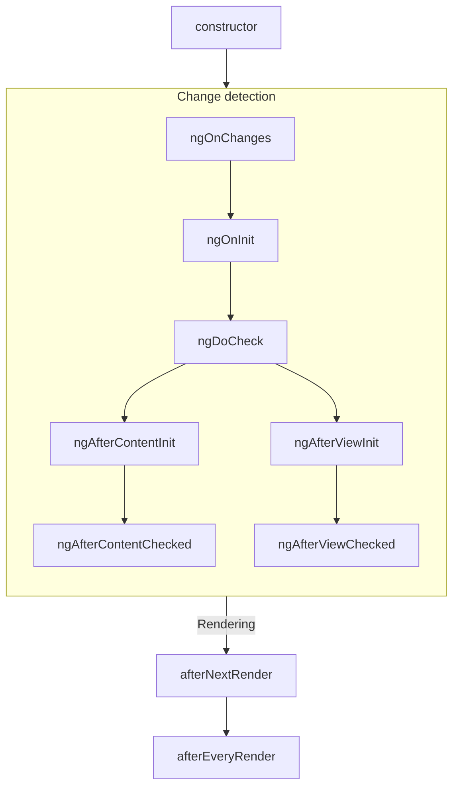
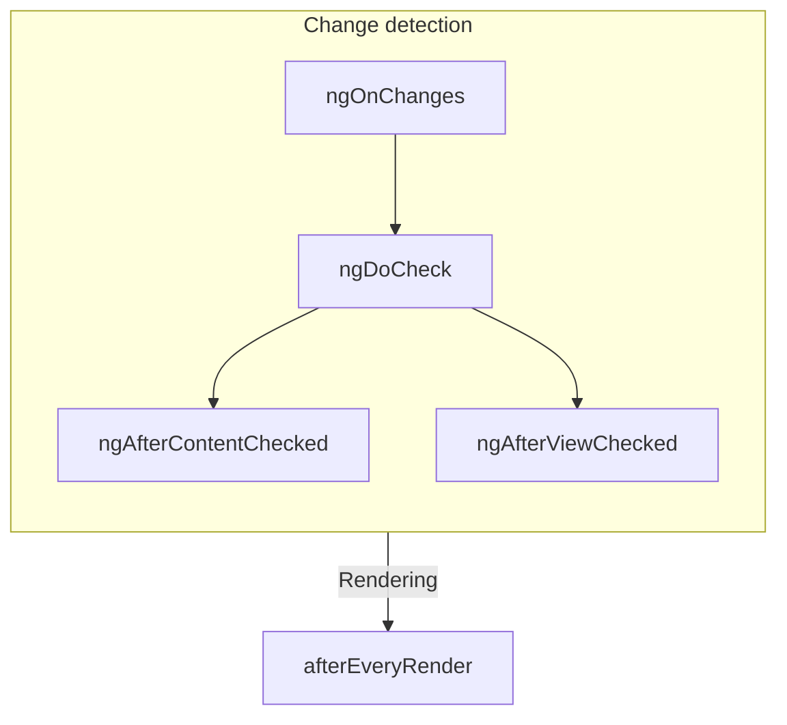

# Component Lifecycle

## Table of Contents

- **[Component Lifecycle](#component-lifecycle)**
  - [Summary](#summary)
  - [Lifecycle interfaces](#lifecycle-interfaces)
  - [Execution order](#execution-order)
  - [Showing dynamic text](#showing-dynamic-text)
  - [Setting dynamic properties and attributes](#setting-dynamic-properties-and-attributes)
  - [Handling user interaction](#handling-user-interaction)
  - [Control flow with `@if` and `@for`](#control-flow-with-if-and-for)
  - [Next Step](#next-step)
- **[Adding event listeners](#adding-event-listeners)**
  - [Listening to native events](#listening-to-native-events)
  - [Accessing the event argument](#accessing-the-event-argument)
  - [Using key modifiers](#using-key-modifiers)
  - [Listening on global targets](#listening-on-global-targets)
  - [Preventing event default behavior](#preventing-event-default-behavior)
  - [Extend event handling](#extend-event-handling)
  - [Render dynamic text with text interpolation](#render-dynamic-text-with-text-interpolation)
  - [Binding dynamic properties and attributes](#binding-dynamic-properties-and-attributes)
  - [CSS class and style property bindings](#css-class-and-style-property-bindings)
  - [ARIA attributes](#aria-attributes)
- **[Control flow](#control-flow)**
  - [Conditionally display content with `@if`, `@else if` and `@else`](#conditionally-display-content-with-if-else-if-and-else)
  - [Repeat content with the `@for` block](#repeat-content-with-the-for-block)
  - [Conditionally display content with the `@switch` block](#conditionally-display-content-with-the-switch-block)
- **[Variables in templates](#variables-in-templates)**
  - [Local template variables with `@let`](#local-template-variables-with-let)
  - [Template reference variables](#template-reference-variables)
- **[Deferred loading with `@defer`](#deferred-loading-with-defer)**
  - [Which dependencies are deferred?](#which-dependencies-are-deferred)
  - [How to manage different stages of deferred loading](#how-to-manage-different-stages-of-deferred-loading)
  - [Controlling deferred content loading with triggers](#controlling-deferred-content-loading-with-triggers)
  - [Prefetching data with `prefetch`](#prefetching-data-with-prefetch)
  - [Testing `@defer` blocks](#testing-defer-blocks)
  - [Does `@defer` work with `NgModule`?](#does-defer-work-with-ngmodule)
  - [Compatibility between `@defer` blocks and Hot Module Reload (HMR)](#compatibility-between-defer-blocks-and-hot-module-reload-hmr)
  - [How does `@defer` work with server-side rendering (SSR) and static-site generation (SSG)?](#how-does-defer-work-with-server-side-rendering-ssr-and-static-site-generation-ssg)
  - [Barrel files and lazy chunks](#barrel-files-and-lazy-chunks)
  - [Best practices for deferring views](#best-practices-for-deferring-views)
- **[Expression Syntax](#expression-syntax)**
  - [Value literals](#value-literals)
  - [Globals](#globals)
  - [Local variables](#local-variables)
  - [What operators are supported?](#what-operators-are-supported)
  - [Lexical context for expressions](#lexical-context-for-expressions)
  - [Declarations](#declarations)

---


TIP: This guide assumes you've already read the [Essentials Guide](essentials). Read that first if you're new to Angular.

A component's **lifecycle** is the sequence of steps that happen between the component's creation
and its destruction. Each step represents a different part of Angular's process for rendering
components and checking them for updates over time.

In your components, you can implement **lifecycle hooks** to run code during these steps.
Lifecycle hooks that relate to a specific component instance are implemented as methods on your
component class. Lifecycle hooks that relate the Angular application as a whole are implemented
as functions that accept a callback.

A component's lifecycle is tightly connected to how Angular checks your components for changes over
time. For the purposes of understanding this lifecycle, you only need to know that Angular walks
your application tree from top to bottom, checking template bindings for changes. The lifecycle
hooks described below run while Angular is doing this traversal. This traversal visits each
component exactly once, so you should always avoid making further state changes in the middle of the
process.

## Summary

<table>
    <tr>
      <td><strong>Phase</strong></td>
      <td><strong>Method</strong></td>
      <td><strong>Summary</strong></td>
    </tr>
    <tr>
      <td>Creation</td>
      <td><code>constructor</code></td>
      <td>
        <a href="https://developer.mozilla.org/docs/Web/JavaScript/Reference/Classes/constructor" target="_blank">
          Standard JavaScript class constructor
        </a>. Runs when Angular instantiates the component.
      </td>
    </tr>
    <tr>
      <td rowspan="7">Change<p>Detection</td>
      <td><code>ngOnInit</code>
      </td>
      <td>Runs once after Angular has initialized all the component's inputs.</td>
    </tr>
    <tr>
      <td><code>ngOnChanges</code></td>
      <td>Runs every time the component's inputs have changed.</td>
    </tr>
    <tr>
      <td><code>ngDoCheck</code></td>
      <td>Runs every time this component is checked for changes.</td>
    </tr>
    <tr>
      <td><code>ngAfterContentInit</code></td>
      <td>Runs once after the component's <em>content</em> has been initialized.</td>
    </tr>
    <tr>
      <td><code>ngAfterContentChecked</code></td>
      <td>Runs every time this component content has been checked for changes.</td>
    </tr>
    <tr>
      <td><code>ngAfterViewInit</code></td>
      <td>Runs once after the component's <em>view</em> has been initialized.</td>
    </tr>
    <tr>
      <td><code>ngAfterViewChecked</code></td>
      <td>Runs every time the component's view has been checked for changes.</td>
    </tr>
    <tr>
      <td rowspan="2">Rendering</td>
      <td><code>afterNextRender</code></td>
      <td>Runs once the next time that <strong>all</strong> components have been rendered to the DOM.</td>
    </tr>
    <tr>
      <td><code>afterEveryRender</code></td>
      <td>Runs every time <strong>all</strong> components have been rendered to the DOM.</td>
    </tr>
    <tr>
      <td>Destruction</td>
      <td><code>ngOnDestroy</code></td>
      <td>Runs once before the component is destroyed.</td>
    </tr>
  </table>
### ngOnInit

The `ngOnInit` method runs after Angular has initialized all the components inputs with their
initial values. A component's `ngOnInit` runs exactly once.

This step happens _before_ the component's own template is initialized. This means that you can
update the component's state based on its initial input values.

### ngOnChanges

The `ngOnChanges` method runs after any component inputs have changed.

This step happens _before_ the component's own template is checked. This means that you can update
the component's state based on its initial input values.

During initialization, the first `ngOnChanges` runs before `ngOnInit`.

#### Inspecting changes

The `ngOnChanges` method accepts one `SimpleChanges` argument. This object is
a [`Record`](https://www.typescriptlang.org/docs/handbook/utility-types.html#recordkeys-type)
mapping each component input name to a `SimpleChange` object. Each `SimpleChange` contains the
input's previous value, its current value, and a flag for whether this is the first time the input
has changed.

You can optionally pass the current class or this as the first generic argument for stronger type checking.

```ts
@Component({
  /* ... */
})
export class UserProfile {
  name = input('');

  ngOnChanges(changes: SimpleChanges<UserProfile>) {
    if (changes.name) {
      console.log(`Previous: ${changes.name.previousValue}`);
      console.log(`Current: ${changes.name.currentValue}`);
      console.log(`Is first ${changes.name.firstChange}`);
    }
  }
}
```

If you provide an `alias` for any input properties, the `SimpleChanges` Record still uses the
TypeScript property name as a key, rather than the alias.

### ngOnDestroy

The `ngOnDestroy` method runs once just before a component is destroyed. Angular destroys a
component when it is no longer shown on the page, such as being hidden by `@if` or upon navigating
to another page.

#### DestroyRef

As an alternative to the `ngOnDestroy` method, you can inject an instance of `DestroyRef`. You can
register a callback to be invoked upon the component's destruction by calling the `onDestroy` method
of `DestroyRef`.

```ts
@Component({
  /* ... */
})
export class UserProfile {
  constructor() {
    inject(DestroyRef).onDestroy(() => {
      console.log('UserProfile destruction');
    });
  }
}
```

You can pass the `DestroyRef` instance to functions or classes outside your component. Use this
pattern if you have other code that should run some cleanup behavior when the component is
destroyed.

You can also use `DestroyRef` to keep setup code close to cleanup code, rather than putting
all cleanup code in the `ngOnDestroy` method.

##### Detecting instance destruction

`DestroyRef` provides a `destroyed` property that allows checking whether a given instance has already been destroyed. This is useful for avoiding operations on destroyed components, especially when dealing with delayed or asynchronous logic.

By checking `destroyRef.destroyed`, you can prevent executing code after the instance has been cleaned up, avoiding potential errors such as `NG0911: View has already been destroyed.`.

### ngDoCheck

The `ngDoCheck` method runs before every time Angular checks a component's template for changes.

You can use this lifecycle hook to manually check for state changes outside of Angular's normal
change detection, manually updating the component's state.

This method runs very frequently and can significantly impact your page's performance. Avoid
defining this hook whenever possible, only using it when you have no alternative.

During initialization, the first `ngDoCheck` runs after `ngOnInit`.

### ngAfterContentInit

The `ngAfterContentInit` method runs once after all the children nested inside the component (its
_content_) have been initialized.

You can use this lifecycle hook to read the results of
[content queries](guide/components/queries#content-queries). While you can access the initialized
state of these queries, attempting to change any state in this method results in an
[ExpressionChangedAfterItHasBeenCheckedError](errors/NG0100)

### ngAfterContentChecked

The `ngAfterContentChecked` method runs every time the children nested inside the component (its
_content_) have been checked for changes.

This method runs very frequently and can significantly impact your page's performance. Avoid
defining this hook whenever possible, only using it when you have no alternative.

While you can access the updated state
of [content queries](guide/components/queries#content-queries) here, attempting to
change any state in this method results in
an [ExpressionChangedAfterItHasBeenCheckedError](errors/NG0100).

### ngAfterViewInit

The `ngAfterViewInit` method runs once after all the children in the component's template (its
_view_) have been initialized.

You can use this lifecycle hook to read the results of
[view queries](guide/components/queries#view-queries). While you can access the initialized state of
these queries, attempting to change any state in this method results in an
[ExpressionChangedAfterItHasBeenCheckedError](errors/NG0100)

### ngAfterViewChecked

The `ngAfterViewChecked` method runs every time the children in the component's template (its
_view_) have been checked for changes.

This method runs very frequently and can significantly impact your page's performance. Avoid
defining this hook whenever possible, only using it when you have no alternative.

While you can access the updated state of [view queries](guide/components/queries#view-queries)
here, attempting to
change any state in this method results in
an [ExpressionChangedAfterItHasBeenCheckedError](errors/NG0100).

### afterEveryRender and afterNextRender

The `afterEveryRender` and `afterNextRender` functions let you register a **render callback** to be
invoked after Angular has finished rendering _all components_ on the page into the DOM.

These functions are different from the other lifecycle hooks described in this guide. Rather than a
class method, they are standalone functions that accept a callback. The execution of render
callbacks are not tied to any specific component instance, but instead an application-wide hook.

`afterEveryRender` and `afterNextRender` must be called in
an [injection context](guide/di/dependency-injection-context), typically a
component's constructor.

You can use render callbacks to perform manual DOM operations.
See [Using DOM APIs](guide/components/dom-apis) for guidance on working with the DOM in Angular.

Render callbacks do not run during server-side rendering or during build-time pre-rendering.

#### after\*Render phases

When using `afterEveryRender` or `afterNextRender`, you can optionally split the work into phases. The
phase gives you control over the sequencing of DOM operations, letting you sequence _write_
operations before _read_ operations in order to minimize
[layout thrashing](https://web.dev/avoid-large-complex-layouts-and-layout-thrashing). In order to
communicate across phases, a phase function may return a result value that can be accessed in the
next phase.

```ts
import {Component, ElementRef, afterNextRender} from '@angular/core';

@Component({
  /*...*/
})
export class UserProfile {
  private prevPadding = 0;
  private elementHeight = 0;

  constructor() {
    const elementRef = inject(ElementRef);
    const nativeElement = elementRef.nativeElement;

    afterNextRender({
      // Use the `Write` phase to write to a geometric property.
      write: () => {
        const padding = computePadding();
        const changed = padding !== this.prevPadding;
        if (changed) {
          nativeElement.style.padding = padding;
        }
        return changed; // Communicate whether anything changed to the read phase.
      },

      // Use the `Read` phase to read geometric properties after all writes have occurred.
      read: (didWrite) => {
        if (didWrite) {
          this.elementHeight = nativeElement.getBoundingClientRect().height;
        }
      },
    });
  }
}
```

There are four phases, run in the following order:

| Phase            | Description                                                                                                                                                                                           |
| ---------------- | ----------------------------------------------------------------------------------------------------------------------------------------------------------------------------------------------------- |
| `earlyRead`      | Use this phase to read any layout-affecting DOM properties and styles that are strictly necessary for subsequent calculation. Avoid this phase if possible, preferring the `write` and `read` phases. |
| `write`          | Use this phase to write layout-affecting DOM properties and styles.                                                                                                                                   |
| `mixedReadWrite` | Default phase. Use for any operations need to both read and write layout-affecting properties and styles. Avoid this phase if possible, preferring the explicit `write` and `read` phases.            |
| `read`           | Use this phase to read any layout-affecting DOM properties.                                                                                                                                           |

## Lifecycle interfaces

Angular provides a TypeScript interface for each lifecycle method. You can optionally import
and `implement` these interfaces to ensure that your implementation does not have any typos or
misspellings.

Each interface has the same name as the corresponding method without the `ng` prefix. For example,
the interface for `ngOnInit` is `OnInit`.

```ts
@Component({
  /* ... */
})
export class UserProfile implements OnInit {
  ngOnInit() {
    /* ... */
  }
}
```

## Execution order

The following diagrams show the execution order of Angular's lifecycle hooks.

### During initialization



### Subsequent updates



### Ordering with directives

When you put one or more directives on the same element as a component, either in a template or with
the `hostDirectives` property, the framework does not guarantee any ordering of a given lifecycle
hook between the component and the directives on a single element. Never depend on an observed
ordering, as this may change in later versions of Angular.
Component templates aren't just static HTML— they can use data from your component class and set up handlers for user interaction.

## Showing dynamic text

In Angular, a _binding_ creates a dynamic connection between a component's template and its data. This connection ensures that changes to the component's data automatically update the rendered template.

You can create a binding to show some dynamic text in a template by using double curly-braces:

```typescript
@Component({
  selector: 'user-profile',
  template: `<h1>Profile for {{ userName() }}</h1>`,
})
export class UserProfile {
  userName = signal('pro_programmer_123');
}
```

When Angular renders the component, you see:

```html
<h1>Profile for pro_programmer_123</h1>
```

Angular automatically keeps the binding up-to-date when the value of the signal changes. Building on
the example above, if we update the value of the `userName` signal:

```typescript
this.userName.set('cool_coder_789');
```

The rendered page updates to reflect the new value:

```html
<h1>Profile for cool_coder_789</h1>
```

## Setting dynamic properties and attributes

Angular supports binding dynamic values into DOM properties with square brackets:

```typescript
@Component({
  /*...*/
  // Set the `disabled` property of the button based on the value of `isValidUserId`.
  template: `<button [disabled]="!isValidUserId()">Save changes</button>`,
})
export class UserProfile {
  isValidUserId = signal(false);
}
```

You can also bind to HTML _attributes_ by prefixing the attribute name with `attr.`:

```html
<!-- Bind the `role` attribute on the `<ul>` element to value of `listRole`. -->
<ul [attr.role]="listRole()"></ul>
```

Angular automatically updates DOM properties and attributes when the bound value changes.

## Handling user interaction

Angular lets you add event listeners to an element in your template with parentheses:

```typescript
@Component({
  /*...*/
  // Add an 'click' event handler that calls the `cancelSubscription` method.
  template: `<button (click)="cancelSubscription()">Cancel subscription</button>`,
})
export class UserProfile {
  /* ... */

  cancelSubscription() {
    /* Your event handling code goes here. */
  }
}
```

If you need to pass the [event](https://developer.mozilla.org/docs/Web/API/Event) object to your listener, you can use Angular's built-in `$event` variable inside the function call:

```typescript
@Component({
  /*...*/
  // Add an 'click' event handler that calls the `cancelSubscription` method.
  template: `<button (click)="cancelSubscription($event)">Cancel subscription</button>`,
})
export class UserProfile {
  /* ... */

  cancelSubscription(event: Event) {
    /* Your event handling code goes here. */
  }
}
```

## Control flow with `@if` and `@for`

You can conditionally hide and show parts of a template with Angular's `@if` block:

```html
<h1>User profile</h1>

@if (isAdmin()) {
  <h2>Admin settings</h2>
  <!-- ... -->
}
```

The `@if` block also supports an optional `@else` block:

```html
<h1>User profile</h1>

@if (isAdmin()) {
  <h2>Admin settings</h2>
  <!-- ... -->
} @else {
  <h2>User settings</h2>
  <!-- ... -->
}
```

You can repeat part of a template multiple times with Angular's `@for` block:

```html
<h1>User profile</h1>

<ul class="user-badge-list">
  @for (badge of badges(); track badge.id) {
    <li class="user-badge">{{ badge.name }}</li>
  }
</ul>
```

Angular uses the `track` keyword, shown in the example above, to associate data with the DOM elements created by `@for`. See [_Why is track in @for blocks important?_](guide/templates/control-flow#why-is-track-in-for-blocks-important) for more info.

TIP: Want to know more about Angular templates? See the [In-depth Templates guide](guide/templates) for the full details.

## Next Step

Now that you have dynamic data and templates in the application, it's time to learn how to enhance templates by conditionally hiding or showing certain elements, looping over elements, and more.
# Adding event listeners

Angular supports defining event listeners on an element in your template by specifying the event name inside parentheses along with a statement that runs every time the event occurs.

## Listening to native events

When you want to add event listeners to an HTML element, you wrap the event with parentheses, `()`, which allows you to specify a listener statement.

```typescript
@Component({
  template: `
    <input type="text" (keyup)="updateField()" />
  `,
  ...
})
export class App{
  updateField(): void {
    console.log('Field is updated!');
  }
}
```

In this example, Angular calls `updateField` every time the `<input>` element emits a `keyup` event.

You can add listeners for any native events, such as: `click`, `keydown`, `mouseover`, etc. To learn more, check out the [all available events on elements on MDN](https://developer.mozilla.org/en-US/docs/Web/API/Element#events).

## Accessing the event argument

In every template event listener, Angular provides a variable named `$event` that contains a reference to the event object.

```typescript
@Component({
  template: `
    <input type="text" (keyup)="updateField($event)" />
  `,
  ...
})
export class App {
  updateField(event: KeyboardEvent): void {
    console.log(`The user pressed: ${event.key}`);
  }
}
```

## Using key modifiers

When you want to capture specific keyboard events for a specific key, you might write some code like the following:

```typescript
@Component({
  template: `
    <input type="text" (keyup)="updateField($event)" />
  `,
  ...
})
export class App {
  updateField(event: KeyboardEvent): void {
    if (event.key === 'Enter') {
      console.log('The user pressed enter in the text field.');
    }
  }
}
```

However, since this is a common scenario, Angular lets you filter the events by specifying a specific key using the period (`.`) character. By doing so, code can be simplified to:

```typescript
@Component({
  template: `
    <input type="text" (keyup.enter)="updateField($event)" />
  `,
  ...
})
export class App{
  updateField(event: KeyboardEvent): void {
    console.log('The user pressed enter in the text field.');
  }
}
```

You can also add additional key modifiers:

```html
<!-- Matches shift and enter -->
<input type="text" (keyup.shift.enter)="updateField($event)" />
```

Angular supports the modifiers `alt`, `control`, `meta`, and `shift`.

You can specify the key or code that you would like to bind to keyboard events. The key and code fields are a native part of the browser keyboard event object. By default, event binding assumes you want to use the [Key values for keyboard events](https://developer.mozilla.org/docs/Web/API/UI_Events/Keyboard_event_key_values).

Angular also allows you to specify [Code values for keyboard events](https://developer.mozilla.org/docs/Web/API/UI_Events/Keyboard_event_code_values) by providing a built-in `code` suffix.

```html
<!-- Matches alt and left shift -->
<input type="text" (keydown.code.alt.shiftleft)="updateField($event)" />
```

This can be useful for handling keyboard events consistently across different operating systems. For example, when using the Alt key on macOS devices, the `key` property reports the key based on the character already modified by the Alt key. This means that a combination like Alt + S reports a `key` value of `'ß'`. The `code` property, however, corresponds to the physical or virtual button pressed rather than the character produced.

## Listening on global targets

Global target names can be used to prefix an event. The 3 supported global targets are `window`, `document` and `body`.

```typescript
@Component({
  /* ... */
  host: {
    'window:click': 'onWindowClick()',
    'document:click': 'onDocumentClick()',
    'body:click': 'onBodyClick()',
  },
})
export class MyView {}
```

## Preventing event default behavior

If your event handler should replace the native browser behavior, you can use the event object's [`preventDefault` method](https://developer.mozilla.org/en-US/docs/Web/API/Event/preventDefault):

```typescript
@Component({
  template: `
    <a href="#overlay" (click)="showOverlay($event)">
  `,
  ...
})
export class App{
  showOverlay(event: PointerEvent): void {
    event.preventDefault();
    console.log('Show overlay without updating the URL!');
  }
}
```

If the event handler statement evaluates to `false`, Angular automatically calls `preventDefault()`, similar to [native event handler attributes](https://developer.mozilla.org/en-US/docs/Web/HTML/Reference/Attributes#event_handler_attributes). _Always prefer explicitly calling `preventDefault`_, as this approach makes the code's intent obvious.

## Extend event handling

Angular’s event system is extensible via custom event plugins registered with the `EVENT_MANAGER_PLUGINS` injection token.

### Implementing Event Plugin

To create a custom event plugin, extend the `EventManagerPlugin` class and implement the required methods.

```ts
import {Injectable} from '@angular/core';
import {EventManagerPlugin} from '@angular/platform-browser';

@Injectable()
export class DebounceEventPlugin extends EventManagerPlugin {
  constructor() {
    super(document);
  }

  // Define which events this plugin supports
  override supports(eventName: string) {
    return /debounce/.test(eventName);
  }

  // Handle the event registration
  override addEventListener(element: HTMLElement, eventName: string, handler: Function) {
    // Parse the event: e.g., "click.debounce.500"
    // event: "click", delay: 500
    const [event, method, delay = 300] = eventName.split('.');

    let timeoutId: number;

    const listener = (event: Event) => {
      clearTimeout(timeoutId);
      timeoutId = setTimeout(() => {
        handler(event);
      }, delay);
    };

    element.addEventListener(event, listener);

    // Return cleanup function
    return () => {
      clearTimeout(timeoutId);
      element.removeEventListener(event, listener);
    };
  }
}
```

Register your custom plugin using the `EVENT_MANAGER_PLUGINS` token in your application's providers:

```ts
import {bootstrapApplication} from '@angular/platform-browser';
import {EVENT_MANAGER_PLUGINS} from '@angular/platform-browser';
import {App} from './app';
import {DebounceEventPlugin} from './debounce-event-plugin';

bootstrapApplication(App, {
  providers: [
    {
      provide: EVENT_MANAGER_PLUGINS,
      useClass: DebounceEventPlugin,
      multi: true,
    },
  ],
});
```

Once registered, you can use your custom event syntax in templates, as well as with the `host` property:

```typescript
@Component({
  template: `
    <input
      type="text"
      (input.debounce.500)="onSearch($event.target.value)"
      placeholder="Search..."
    />
  `,
  ...
})
export class Search {
 onSearch(query: string): void {
    console.log('Searching for:', query);
  }
}
```

```ts
@Component({
  ...,
  host: {
    '(click.debounce.500)': 'handleDebouncedClick()',
  },
})
export class AwesomeCard {
  handleDebouncedClick(): void {
   console.log('Debounced click!');
  }
}
```
# Binding dynamic text, properties and attributes

In Angular, a **binding** creates a dynamic connection between a component's template and its data. This connection ensures that changes to the component's data automatically update the rendered template.

## Render dynamic text with text interpolation

You can bind dynamic text in templates with double curly braces, which tells Angular that it is responsible for the expression inside and ensuring it is updated correctly. This is called **text interpolation**.

```typescript
@Component({
  template: `
    <p>Your color preference is {{ theme }}.</p>
  `,
  ...
})
export class App {
  theme = 'dark';
}
```

In this example, when the snippet is rendered to the page, Angular will replace `{{ theme }}` with `dark`.

```html
<!-- Rendered Output -->
<p>Your color preference is dark.</p>
```

Bindings that change over time should read values from [signals](/guide/signals). Angular tracks the signals read in the template, and updates the rendered page when those signal values change.

```typescript
@Component({
  template: `
    <!-- Does not necessarily update when `welcomeMessage` changes. -->
    <p>{{ welcomeMessage }}</p>

    <p>Your color preference is {{ theme() }}.</p> <!-- Always updates when the value of the `theme` signal changes. -->
  `
  ...
})
export class App {
  welcomeMessage = "Welcome, enjoy this app that we built for you";
  theme = signal('dark');
}
```

For more details, see the [Signals guide](/guide/signals).

Continuing the theme example, if a user clicks on a button that updates the `theme` signal to `'light'` after the page loads, the page updates accordingly to:

```html
<!-- Rendered Output -->
<p>Your color preference is light.</p>
```

You can use text interpolation anywhere you would normally write text in HTML.

All expression values are converted to a string. Objects and arrays are converted using the value’s `toString` method.

## Binding dynamic properties and attributes

Angular supports binding dynamic values into object properties and HTML attributes with square brackets.

You can bind to properties on an HTML element's DOM instance, a [component](/guide/components) instance, or a [directive](/guide/directives) instance.

### Native element properties

Every HTML element has a corresponding DOM representation. For example, each `<button>` HTML element corresponds to an instance of `HTMLButtonElement` in the DOM. In Angular, you use property bindings to set values directly to the DOM representation of the element.

```html
<!-- Bind the `disabled` property on the button element's DOM object -->
<button [disabled]="isFormValid()">Save</button>
```

In this example, every time `isFormValid` changes, Angular automatically sets the `disabled` property of the `HTMLButtonElement` instance.

### Component and directive properties

When an element is an Angular component, you can use property bindings to set component input properties using the same square bracket syntax.

```html
<!-- Bind the `value` property on the `MyListbox` component instance. -->
<my-listbox [value]="mySelection()" />
```

In this example, every time `mySelection` changes, Angular automatically sets the `value` property of the `MyListbox` instance.

You can bind to directive properties as well.

```html
<!-- Bind to the `ngSrc` property of the `NgOptimizedImage` directive  -->

```

### Attributes

When you need to set HTML attributes that do not have corresponding DOM properties, such as SVG attributes, you can bind attributes to elements in your template with the `attr.` prefix.

<!-- prettier-ignore -->
```html
<!-- Bind the `role` attribute on the `<ul>` element to the component's `listRole` property. -->
<ul [attr.role]="listRole()">
```

In this example, every time `listRole` changes, Angular automatically sets the `role` attribute of the `<ul>` element by calling `setAttribute`.

If the value of an attribute binding is `null`, Angular removes the attribute by calling `removeAttribute`.

### Text interpolation in properties and attributes

You can also use text interpolation syntax in properties and attributes by using the double curly brace syntax instead of square braces around the property or attribute name. When using this syntax, Angular treats the assignment as a property binding.

```html
<!-- Binds a value to the `alt` property of the image element's DOM object. -->

```

## CSS class and style property bindings

Angular supports additional features for binding CSS classes and CSS style properties to elements.

### CSS classes

You can create a CSS class binding to conditionally add or remove a CSS class on an element based on whether the bound value is [truthy or falsy](https://developer.mozilla.org/en-US/docs/Glossary/Truthy).

<!-- prettier-ignore -->
```html
<!-- When `isExpanded` is truthy, add the `expanded` CSS class. -->
<ul [class.expanded]="isExpanded()">
```

You can also bind directly to the `class` property. Angular accepts three types of value:

| Description of `class` value                                                                                                                                      | TypeScript type       |
| ----------------------------------------------------------------------------------------------------------------------------------------------------------------- | --------------------- |
| A string containing one or more CSS classes separated by spaces                                                                                                   | `string`              |
| An array of CSS class strings                                                                                                                                     | `string[]`            |
| An object where each property name is a CSS class name and each corresponding value determines whether that class is applied to the element, based on truthiness. | `Record<string, any>` |

```typescript
@Component({
  template: `
    <ul [class]="listClasses"> ... </ul>
    <section [class]="sectionClasses()"> ... </section>
    <button [class]="buttonClasses()"> ... </button>
  `,
  ...
})
export class UserProfile {
  listClasses = 'full-width outlined';
  sectionClasses = signal(['expandable', 'elevated']);
  buttonClasses = signal({
    highlighted: true,
    embiggened: false,
  });
}
```

The above example renders the following DOM:

<!-- prettier-ignore -->
```html
<ul class="full-width outlined"> ... </ul>
<section class="expandable elevated"> ... </section>
<button class="highlighted"> ... </button>
```

Angular ignores any string values that are not valid CSS class names.

When using static CSS classes, directly binding `class`, and binding specific classes, Angular intelligently combines all of the classes in the rendered result.

```typescript
@Component({
  template: `<ul class="list" [class]="listType()" [class.expanded]="isExpanded()"> ...`,
  ...
})
export class Listbox {
  listType = signal('box');
  isExpanded = signal(true);
}
```

In the example above, Angular renders the `ul` element with all three CSS classes.

<!-- prettier-ignore -->
```html
<ul class="list box expanded">
```

Angular does not guarantee any specific order of CSS classes on rendered elements.

When binding `class` to an array or an object, Angular compares the previous value to the current value with the triple-equals operator (`===`). You must create a new object or array instance when you modify these values in order for Angular to apply any updates.

If an element has multiple bindings for the same CSS class, Angular resolves collisions by following its style precedence order.

NOTE: Class bindings do not support space-separated class names in a single key. They also don't support mutations on objects as the reference of the binding remains the same. If you need one or the other, use the [ngClass](/api/common/NgClass) directive.

### CSS style properties

You can also bind to CSS style properties directly on an element.

<!-- prettier-ignore -->
```html
<!-- Set the CSS `display` property based on the `isExpanded` property. -->
<section [style.display]="isExpanded() ? 'block' : 'none'">
```

You can further specify units for CSS properties that accept units.

<!-- prettier-ignore -->
```html
<!-- Set the CSS `height` property to a pixel value based on the `sectionHeightInPixels` property. -->
<section [style.height.px]="sectionHeightInPixels()">
```

You can also set multiple style values in one binding. Angular accepts the following types of value:

| Description of `style` value                                                                                              | TypeScript type       |
| ------------------------------------------------------------------------------------------------------------------------- | --------------------- |
| A string containing zero or more CSS declarations, such as `"display: flex; margin: 8px"`.                                | `string`              |
| An object where each property name is a CSS property name and each corresponding value is the value of that CSS property. | `Record<string, any>` |

```typescript
@Component({
  template: `
    <ul [style]="listStyles()"> ... </ul>
    <section [style]="sectionStyles()"> ... </section>
  `,
  ...
})
export class UserProfile {
  listStyles = signal('display: flex; padding: 8px');
  sectionStyles = signal({
    border: '1px solid black',
    'font-weight': 'bold',
  });
}
```

The above example renders the following DOM.

<!-- prettier-ignore -->
```html
<ul style="display: flex; padding: 8px"> ... </ul>
<section style="border: 1px solid black; font-weight: bold"> ... </section>
```

When binding `style` to an object, Angular compares the previous value to the current value with the triple-equals operator (`===`). You must create a new object instance when you modify these values in order for Angular to apply any updates.

If an element has multiple bindings for the same style property, Angular resolves collisions by following its style precedence order.

## ARIA attributes

Angular supports binding string values to ARIA attributes.

```html
<button type="button" [aria-label]="actionLabel()">
  {{ actionLabel() }}
</button>
```

Angular writes the string value to the element’s `aria-label` attribute and removes it when the bound value is `null`.

Some ARIA features expose DOM properties or directive inputs that accept structured values (such as element references). Use standard property bindings for those cases. See the [accessibility guide](/best-practices/a11y#aria-attributes-and-properties) for examples and additional guidance.
# Control flow

Angular templates support control flow blocks that let you conditionally show, hide, and repeat elements.

## Conditionally display content with `@if`, `@else if` and `@else`

The `@if` block conditionally displays its content when its condition expression is truthy:

```html
@if (a > b) {
  <p>{{ a }} is greater than {{ b }}</p>
}
```

If you want to display alternative content, you can do so by providing any number of `@else if` blocks and a singular `@else` block.

```html
@if (a > b) {
  {{ a }} is greater than {{ b }}
} @else if (b > a) {
  {{ a }} is less than {{ b }}
} @else {
  {{ a }} is equal to {{ b }}
}
```

### Referencing the conditional expression's result

The `@if` conditional supports saving the result of the conditional expression into a variable for reuse inside of the block.

```html
@if (user.profile.settings.startDate; as startDate) {
  {{ startDate }}
}
```

This can be useful for referencing longer expressions that would be easier to read and maintain within the template.

## Repeat content with the `@for` block

The `@for` block loops through a collection and repeatedly renders the content of a block. The collection can be any JavaScript [iterable](https://developer.mozilla.org/docs/Web/JavaScript/Reference/Iteration_protocols), but Angular has additional performance optimizations for `Array` values.

A typical `@for` loop looks like:

```html
@for (item of items; track item.id) {
  {{ item.name }}
}
```

Angular's `@for` block does not support flow-modifying statements like JavaScript's `continue` or `break`.

### Why is `track` in `@for` blocks important?

The `track` expression allows Angular to maintain a relationship between your data and the DOM nodes on the page. This allows Angular to optimize performance by executing the minimum necessary DOM operations when the data changes.

Using track effectively can significantly improve your application's rendering performance when looping over data collections.

Select a property that uniquely identifies each item in the `track` expression. If your data model includes a uniquely identifying property, commonly `id` or `uuid`, use this value. If your data does not include a field like this, strongly consider adding one.

For static collections that never change, you can use `$index` to tell Angular to track each item by its index in the collection.

If no other option is available, you can use the item itself as a tracking key. This tells Angular to track the item by its reference identity using the triple-equals operator (`===`). Avoid this option whenever possible as it can lead to significantly slower rendering updates, as Angular has no way to map which data item corresponds to which DOM nodes.

```html
@for (item of items; track item) {
  {{ item.name }}
}
```

NOTE: Unlike `*ngFor`, the `@for` block prioritizes view reuse. If a tracked property changes but the object reference remains the same, Angular updates the view's bindings (including component inputs) rather than destroying and recreating the entire element.

### Contextual variables in `@for` blocks

Inside `@for` blocks, several implicit variables are always available:

| Variable | Meaning                                       |
| -------- | --------------------------------------------- |
| `$count` | Number of items in a collection iterated over |
| `$index` | Index of the current row                      |
| `$first` | Whether the current row is the first row      |
| `$last`  | Whether the current row is the last row       |
| `$even`  | Whether the current row index is even         |
| `$odd`   | Whether the current row index is odd          |

These variables are always available with these names, but can be aliased via a `let` segment:

```html
@for (item of items; track item.id; let idx = $index, e = $even) {
  <p>Item #{{ idx }}: {{ item.name }}</p>
}
```

The aliasing is useful when nesting `@for` blocks, letting you read variables from the outer `@for` block from an inner `@for` block.

### Providing a fallback for `@for` blocks with the `@empty` block

You can optionally include an `@empty` section immediately after the `@for` block content. The content of the `@empty` block displays when there are no items:

```html
@for (item of items; track item.name) {
  <li>{{ item.name }}</li>
} @empty {
  <li>There are no items.</li>
}
```

## Conditionally display content with the `@switch` block

While the `@if` block is great for most scenarios, the `@switch` block provides an alternate syntax to conditionally render data. Its syntax closely resembles JavaScript's `switch` statement.

```html
@switch (userPermissions) {
  @case ('admin') {
    <app-admin-dashboard />
  }
  @case ('reviewer')
  @case ('editor') {
    <app-editor-dashboard />
  }
  @default {
    <app-viewer-dashboard />
  }
}
```

The value of the conditional expression is compared to the case expression using the triple-equals (`===`) operator.

**`@switch` does not have a fallthrough**, so you do not need an equivalent to a `break` or `return` statement in the block.

You can specify multiple conditions for a single block by have consecutive `@case` statements.

You can optionally include a `@default` block. The content of the `@default` block displays if none of the preceding case expressions match the switch value.

If no `@case` matches the expression and there is no `@default` block, nothing is shown.

### Exhaustive type checking

`@switch` supports exhaustive type checking, allowing Angular to verify at compile time that all possible values of a union type are handled.

By using `@default never;`, you explicitly declare that no remaining cases should exist. If the union type is later extended and a new case is not covered by an @case, Angular’s template type checker will report an error, helping you catch missing branches early.

```html
@Component({
  template: `
    @switch (state) {
      @case ('loggedOut') {
        <button>Login</button>
      }

      @case ('loggedIn') {
        <p>Welcome back!</p>
      }

      @default never; // throws because `@case ('loading')` is missing
    }
  `,
})
export class AppComponent {
  state: 'loggedOut' | 'loading' | 'loggedIn' = 'loggedOut';
}
```

When the switched expression is nested within a union, you must explicitly specify the expression to check for exhaustiveness.

```typescript
@Component({
  template: `
    @switch (state.mode) {
      @case ('show') { {{ state.menu }}; }
      @case ('hide') {}
      @default never(state);
    }
  `,
})
export class App {
  state!: {mode: 'hide'} | {mode: 'show'; menu: number};
}
```
# Variables in templates

Angular has two types of variable declarations in templates: local template variables and template reference variables.

HELPFUL: In this guide, “template” does not mean the entire HTML template file. It refers only to a specific template construct or expression within the file.

## Local template variables with `@let`

Angular's `@let` syntax allows you to define a local variable and re-use it across a template, similar to the [JavaScript `let` syntax](https://developer.mozilla.org/en-US/docs/Web/JavaScript/Reference/Statements/let).

### Using `@let`

Use `@let` to declare a variable whose value is based on the result of a template expression. Angular automatically keeps the variable's value up-to-date with the given expression, similar to [bindings](/guide/templates/binding).

```html
@let name = user.name;
@let greeting = 'Hello, ' + name;
@let data = data$ | async;
@let pi = 3.14159;
@let coordinates = {x: 50, y: 100};
@let longExpression =
  'Lorem ipsum dolor sit amet, consectetur adipiscing elit ' +
  'sed do eiusmod tempor incididunt ut labore et dolore magna ' +
  'Ut enim ad minim veniam...';
```

Each `@let` block can declare exactly one variable. You cannot declare multiple variables in the same block with a comma.

### Referencing the value of `@let`

Once you've declared a variable with `@let`, you can reuse it in the same template:

```html
@let user = user$ | async;

@if (user) {
  <h1>Hello, {{ user.name }}</h1>
  <user-avatar [photo]="user.photo" />

  <ul>
    @for (snack of user.favoriteSnacks; track snack.id) {
      <li>{{ snack.name }}</li>
    }
  </ul>

  <button (click)="update(user)">Update profile</button>
}
```

### Assignability

A key difference between `@let` and JavaScript's `let` is that `@let` cannot be reassigned after declaration. However, Angular automatically keeps the variable's value up-to-date with the given expression.

```html
@let value = 1;

<!-- Invalid - This does not work! -->
<button (click)="value = value + 1">Increment the value</button>
```

### Variable scope

`@let` declarations are scoped to the current view and its descendants. Angular creates a new view at component boundaries and wherever a template might contain dynamic content, such as control flow blocks, `@defer` blocks, or structural directives.

Since `@let` declarations are not hoisted, they **cannot** be accessed by parent views or siblings:

```html
@let topLevel = value;

@let insideDiv = value;
<!-- Valid -->
{{ topLevel }}
<!-- Valid -->
{{ insideDiv }}

@if (condition) {
  <!-- Valid -->
  {{ topLevel + insideDiv }}

  @let nested = value;

  @if (condition) {
    <!-- Valid -->
    {{ topLevel + insideDiv + nested }}
  }
}

<!-- Error, not hoisted from @if -->
{{ nested }}
```

### Full syntax

The `@let` syntax is formally defined as:

- The `@let` keyword.
- Followed by one or more whitespaces, not including new lines.
- Followed by a valid JavaScript name and zero or more whitespaces.
- Followed by the = symbol and zero or more whitespaces.
- Followed by an Angular expression which can be multi-line.
- Terminated by the `;` symbol.

## Template reference variables

Template reference variables give you a way to declare a variable that references a value from an element in your template.

A template reference variable can refer to the following:

- a DOM element within a template (including [custom elements](https://developer.mozilla.org/en-US/docs/Web/API/Web_components/Using_custom_elements))
- an Angular component or directive
- a [TemplateRef](/api/core/TemplateRef) from an [ng-template](/api/core/ng-template)

You can use template reference variables to read information from one part of the template in another part of the same template.

### Declaring a template reference variable

You can declare a variable on an element in a template by adding an attribute that starts with the hash character (`#`) followed by the variable name.

```html
<!-- Create a template reference variable named "taskInput", referring to the HTMLInputElement. -->
<input #taskInput placeholder="Enter task name" />
```

### Assigning values to template reference variables

Angular assigns a value to template variables based on the element on which the variable is declared.

If you declare the variable on a Angular component, the variable refers to the component instance.

```html
<!-- The `startDate` variable is assigned the instance of `MyDatepicker`. -->
<my-datepicker #startDate />
```

If you declare the variable on an `<ng-template>` element, the variable refers to a TemplateRef instance which represents the template. For more information, see [How Angular uses the asterisk, \*, syntax](/guide/directives/structural-directives#structural-directive-shorthand) in [Structural directives](/guide/directives/structural-directives).

```html
<!-- The `myFragment` variable is assigned the `TemplateRef` instance corresponding to this template fragment. -->
<ng-template #myFragment>
  <p>This is a template fragment</p>
</ng-template>
```

If you declare the variable on any other displayed element, the variable refers to the `HTMLElement` instance.

```html
<!-- The "taskInput" variable refers to the HTMLInputElement instance. -->
<input #taskInput placeholder="Enter task name" />
```

#### Assigning a reference to an Angular directive

Angular directives may have an `exportAs` property that defines a name by which the directive can be referenced in a template:

```typescript
@Directive({
  selector: '[dropZone]',
  exportAs: 'dropZone',
})
export class DropZone {
  /* ... */
}
```

When you declare a template variable on an element, you can assign that variable a directive instance by specifying this `exportAs` name:

```html
<!-- The `firstZone` variable refers to the `DropZone` directive instance. -->
<section dropZone #firstZone="dropZone">...</section>
```

You cannot refer to a directive that does not specify an `exportAs` name.

### Using template reference variables with queries

In addition to using template variables to read values from another part of the same template, you can also use this style of variable declaration to "mark" an element for [component and directive queries](/guide/components/queries).

When you want to query for a specific element in a template, you can declare a template variable on that element and then query for the element based on the variable name.

```html
<input #description value="Original description" />
```

```typescript
@Component({
  /* ... */,
  template: `<input #description value="Original description">`,
})
export class AppComponent {
  // Query for the input element based on the template variable name.
  @ViewChild('description') input: ElementRef | undefined;
}
```

See [Referencing children with queries](/guide/components/queries) for more information on queries.

### Template variable scope

Just like variables in JavaScript or TypeScript code, template variables are scoped to the template that declares them.

Similarly, [Structural directives](guide/directives/structural-directives) or `<ng-template>` declarations create a new nested template scope, much like JavaScript's control flow statements like `if` and `for` create new lexical scopes. You cannot access template variables within one of these structural directives from outside of its boundaries.

HELPFUL: Define a variable only once in the template so the runtime value remains predictable.

#### Accessing in a nested template

An inner template can access template variables that the outer template defines.

In the following example, changing the text in the `<input>` changes the value in the `<span>` because Angular immediately updates changes through the template variable, `ref1`.

```html
<input #ref1 type="text" [(ngModel)]="firstExample" />

<span *ngIf="true">Value: {{ ref1.value }}</span>
```

In this case, the `*ngIf` on `<span>` creates a new template scope, which includes the `ref1` variable from its parent scope.

However, accessing a template variable from a child scope in the parent template doesn't work:

```html
<!-- avoid -->
<input *ngIf="true" #ref2 type="text" [(ngModel)]="secondExample" />

<span>Value: {{ ref2?.value }}</span>
```

Here, `ref2` is declared in the child scope created by `*ngIf`, and is not accessible from the parent template.
# Deferred loading with `@defer`

Deferrable views, also known as `@defer` blocks, reduce the initial bundle size of your application by deferring the loading of code that is not strictly necessary for the initial rendering of a page. This often results in a faster initial load and improvement in Core Web Vitals (CWV), primarily Largest Contentful Paint (LCP) and Time to First Byte (TTFB).

To use this feature, you can declaratively wrap a section of your template in a @defer block:

```html
@defer {
  <large-component />
}
```

The code for any components, directives, and pipes inside the `@defer` block is split into a separate JavaScript file and loaded only when necessary, after the rest of the template has been rendered.

Deferrable views support a variety of triggers, prefetching options, and sub-blocks for placeholder, loading, and error state management.

## Which dependencies are deferred?

Components, directives, pipes, and any component CSS styles can be deferred when loading an application.

In order for the dependencies within a `@defer` block to be deferred, they need to meet two conditions:

1. **They must be standalone.** Non-standalone dependencies cannot be deferred and are still eagerly loaded, even if they are inside of `@defer` blocks.
1. **They cannot be referenced outside of `@defer` blocks within the same file.** If they are referenced outside the `@defer` block or referenced within ViewChild queries, the dependencies will be eagerly loaded.

The _transitive_ dependencies of the components, directives and pipes used in the `@defer` block do not strictly need to be standalone; transitive dependencies can still be declared in an `NgModule` and participate in deferred loading.

Angular's compiler produces a [dynamic import](https://developer.mozilla.org/en-US/docs/Web/JavaScript/Reference/Operators/import) statement for each component, directive, and pipe used in the `@defer` block. The main content of the block renders after all the imports resolve. Angular does not guarantee any particular order for these imports.

## How to manage different stages of deferred loading

`@defer` blocks have several sub blocks to allow you to gracefully handle different stages in the deferred loading process.

### `@defer`

This is the primary block that defines the section of content that is lazily loaded. It is not rendered initially– deferred content loads and renders once the specified [trigger](#controlling-deferred-content-loading-with-triggers) occurs or the `when` condition is met.

By default, a `@defer` block is triggered when the browser state becomes [idle](/guide/templates/defer#idle).

```html
@defer {
  <large-component />
}
```

### Show placeholder content with `@placeholder`

By default, defer blocks do not render any content before they are triggered.

The `@placeholder` is an optional block that declares what content to show before the `@defer` block is triggered.

```html
@defer {
  <large-component />
} @placeholder {
  <p>Placeholder content</p>
}
```

While optional, certain triggers may require the presence of either a `@placeholder` or a [template reference variable](/guide/templates/variables#template-reference-variables) to function. See the [Triggers](#controlling-deferred-content-loading-with-triggers) section for more details.

Angular replaces placeholder content with the main content once loading is complete. You can use any content in the placeholder section including plain HTML, components, directives, and pipes. Keep in mind the _dependencies of the placeholder block are eagerly loaded_.

The `@placeholder` block accepts an optional parameter to specify the `minimum` amount of time that this placeholder should be shown after the placeholder content initially renders.

```html
@defer {
  <large-component />
} @placeholder (minimum 500ms) {
  <p>Placeholder content</p>
}
```

This `minimum` parameter is specified in time increments of milliseconds (ms) or seconds (s). You can use this parameter to prevent fast flickering of placeholder content in the case that the deferred dependencies are fetched quickly.

### Show loading content with `@loading`

The `@loading` block is an optional block that allows you to declare content that is shown while deferred dependencies are loading. It replaces the `@placeholder` block once loading is triggered.

```html
@defer {
  <large-component />
} @loading {
  
} @placeholder {
  <p>Placeholder content</p>
}
```

Its dependencies are eagerly loaded (similar to `@placeholder`).

The `@loading` block accepts two optional parameters to help prevent fast flickering of content that may occur when deferred dependencies are fetched quickly,:

- `minimum` - the minimum amount of time that this placeholder should be shown
- `after` - the amount of time to wait after loading begins before showing the loading template

```html
@defer {
  <large-component />
} @loading (after 100ms; minimum 1s) {
  
}
```

Both parameters are specified in time increments of milliseconds (ms) or seconds (s). In addition, the timers for both parameters begin immediately after the loading has been triggered.

### Show error state when deferred loading fails with `@error`

The `@error` block is an optional block that displays if deferred loading fails. Similar to `@placeholder` and `@loading`, the dependencies of the @error block are eagerly loaded.

```html
@defer {
  <large-component />
} @error {
  <p>Failed to load large component.</p>
}
```

## Controlling deferred content loading with triggers

You can specify **triggers** that control when Angular loads and displays deferred content.

When a `@defer` block is triggered, it replaces placeholder content with lazily loaded content.

Multiple event triggers can be defined by separating them with a semicolon, `;` and will be evaluated as OR conditions.

There are two types of triggers: `on` and `when`.

### `on`

`on` specifies a condition for when the `@defer` block is triggered.

The available triggers are as follows:

| Trigger                       | Description                                                            |
| ----------------------------- | ---------------------------------------------------------------------- |
| [`idle`](#idle)               | Triggers when the browser is idle. Supports an optional timeout.       |
| [`viewport`](#viewport)       | Triggers when specified content enters the viewport                    |
| [`interaction`](#interaction) | Triggers when the user interacts with specified element                |
| [`hover`](#hover)             | Triggers when the mouse hovers over specified area                     |
| [`immediate`](#immediate)     | Triggers immediately after non-deferred content has finished rendering |
| [`timer`](#timer)             | Triggers after a specific duration                                     |

#### `idle`

The `idle` trigger loads the deferred content once the browser has reached an idle state, based on requestIdleCallback. This is the default behavior with a defer block.

You can optionally specify a timeout in milliseconds that is passed to [`requestIdleCallback`](https://developer.mozilla.org/docs/Web/API/Window/requestIdleCallback). If the browser doesn't schedule the callback soon enough, the work will run no later than the specified timeout.

```html
<!-- @defer (on idle) -->
@defer {
  <large-cmp />
} @placeholder {
  Large component placeholder}

<!-- With a 500ms timeout -->
@defer (on idle(500)) {
  <large-cmp />
}
```

##### Customizing `idle` behavior

You can customize the `idle` trigger by providing your own `IdleService` implementation and registering it with `provideIdleServiceWith` in your application's providers.

```ts
@Service()
class CustomIdleService implements IdleService {
  requestOnIdle(callback: (deadline?: IdleDeadline) => void, options?: IdleRequestOptions) {
    // Custom idle scheduling logic can be implemented here.
  }

  cancelOnIdle(id: number) {
    // Implement custom idle cancellation here.
  }
}

bootstrapApplication(App, {
  providers: [provideIdleServiceWith(CustomIdleService)],
});
```

#### `viewport`

The `viewport` trigger loads the deferred content when the specified content enters the viewport using the [Intersection Observer API](https://developer.mozilla.org/docs/Web/API/Intersection_Observer_API). Observed content may be `@placeholder` content or an explicit element reference.

By default, the `@defer` watches for the placeholder entering the viewport. Placeholders used this way must have a single root element.

```html
@defer (on viewport) {
  <large-cmp />
} @placeholder {
  Large component placeholder}
```

Alternatively, you can specify a [template reference variable](/guide/templates/variables) in the same template as the `@defer` block as the element that is watched to enter the viewport. This variable is passed in as a parameter on the viewport trigger.

```html
Hello!@defer (on viewport(greeting)) {
  <greetings-cmp />
}
```

If you want to customize the options of the `IntersectionObserver`, the `viewport` trigger supports passing in an object literal. The literal supports all properties from the second parameter of `IntersectionObserver`, except for `root`. When using the object literal notation, you have to pass your trigger using the `trigger` property.

```html
Hello!<!-- With options and a trigger -->
@defer (on viewport({trigger: greeting, rootMargin: '100px', threshold: 0.5})) {
  <greetings-cmp />
}

<!-- With options and an implied trigger -->
@defer (on viewport({rootMargin: '100px', threshold: 0.5})) {
  <greetings-cmp />
} @placeholder {
  Implied trigger}
```

#### `interaction`

The `interaction` trigger loads the deferred content when the user interacts with the specified element through `click` or `keydown` events.

By default, the placeholder acts as the interaction element. Placeholders used this way must have a single root element.

```html
@defer (on interaction) {
  <large-cmp />
} @placeholder {
  Large component placeholder}
```

Alternatively, you can specify a [template reference variable](/guide/templates/variables) in the same template as the `@defer` block as the element that is watched for interactions. This variable is passed in as a parameter on the viewport trigger.

```html
Hello!@defer (on interaction(greeting)) {
  <greetings-cmp />
}
```

#### `hover`

The `hover` trigger loads the deferred content when the mouse has hovered over the triggered area through the `mouseover` and `focusin` events.

By default, the placeholder acts as the interaction element. Placeholders used this way must have a single root element.

```html
@defer (on hover) {
  <large-cmp />
} @placeholder {
  Large component placeholder}
```

Alternatively, you can specify a [template reference variable](/guide/templates/variables) in the same template as the `@defer` block as the element that is watched to enter the viewport. This variable is passed in as a parameter on the viewport trigger.

```html
Hello!@defer (on hover(greeting)) {
  <greetings-cmp />
}
```

#### `immediate`

The `immediate` trigger loads the deferred content immediately. This means that the deferred block loads as soon as all other non-deferred content has finished rendering.

```html
@defer (on immediate) {
  <large-cmp />
} @placeholder {
  Large component placeholder}
```

#### `timer`

The `timer` trigger loads the deferred content after a specified duration.

```html
@defer (on timer(500ms)) {
  <large-cmp />
} @placeholder {
  Large component placeholder}
```

The duration parameter must be specified in milliseconds (`ms`) or seconds (`s`).

### `when`

The `when` trigger accepts a custom conditional expression and loads the deferred content when the condition becomes truthy.

```html
@defer (when condition) {
  <large-cmp />
} @placeholder {
  Large component placeholder}
```

This is a one-time operation– the `@defer` block does not revert back to the placeholder if the condition changes to a falsy value after becoming truthy.

## Prefetching data with `prefetch`

In addition to specifying a condition that determines when deferred content is shown, you can optionally specify a **prefetch trigger**. This trigger lets you load the JavaScript associated with the `@defer` block before the deferred content is shown.

Prefetching enables more advanced behaviors, such as letting you start to prefetch resources before a user has actually seen or interacted with a defer block, but might interact with it soon, making the resources available faster.

You can specify a prefetch trigger similarly to the block's main trigger, but prefixed with the `prefetch` keyword. The block's main trigger and prefetch trigger are separated with a semi-colon character (`;`).

In the example below, the prefetching starts when a browser becomes idle and the contents of the block is rendered only once the user interacts with the placeholder.

```html
@defer (on interaction; prefetch on idle) {
  <large-cmp />
} @placeholder {
  Large component placeholder}

<!-- Prefetching with a 500ms idle timeout -->
@defer (on interaction; prefetch on idle(500)) {
  <large-cmp />
}
```

## Testing `@defer` blocks

Angular provides TestBed APIs to simplify the process of testing `@defer` blocks and triggering different states during testing. By default, `@defer` blocks in tests play through like a defer block would behave in a real application. If you want to manually step through states, you can switch the defer block behavior to `Manual` in the TestBed configuration.

```typescript
it('should render a defer block in different states', async () => {
  // configures the defer block behavior to start in "paused" state for manual control.
  TestBed.configureTestingModule({deferBlockBehavior: DeferBlockBehavior.Manual});
  @Component({
    // ...
    template: `
      @defer {
        <large-component />
      } @placeholder {
        Placeholder
      } @loading {
        Loading...
      }
    `,
  })
  class ExampleA {}
  // Create component fixture.
  const componentFixture = TestBed.createComponent(ExampleA);
  // Retrieve the list of all defer block fixtures and get the first block.
  const deferBlockFixture = (await componentFixture.getDeferBlocks())[0];
  // Renders placeholder state by default.
  expect(componentFixture.nativeElement.innerHTML).toContain('Placeholder');
  // Render loading state and verify rendered output.
  await deferBlockFixture.render(DeferBlockState.Loading);
  expect(componentFixture.nativeElement.innerHTML).toContain('Loading');
  // Render final state and verify the output.
  await deferBlockFixture.render(DeferBlockState.Complete);
  expect(componentFixture.nativeElement.innerHTML).toContain('large works!');
});
```

## Does `@defer` work with `NgModule`?

`@defer` blocks are compatible with both standalone and NgModule-based components, directives and pipes. However, **only standalone components, directives and pipes can be deferred**. NgModule-based dependencies are not deferred and are included in the eagerly loaded bundle.

## Compatibility between `@defer` blocks and Hot Module Reload (HMR)

When Hot Module Replacement (HMR) is active, all `@defer` block chunks are fetched eagerly, overriding any configured triggers. To restore the standard trigger behavior, you must disable HMR by serving your application with the `--no-hmr` flag.

## How does `@defer` work with server-side rendering (SSR) and static-site generation (SSG)?

By default, when rendering an application on the server (either using SSR or SSG), defer blocks always render their `@placeholder` (or nothing if a placeholder is not specified) and triggers are not invoked. On the client, the content of the `@placeholder` is hydrated and triggers are activated.

To render the main content of `@defer` blocks on the server (both SSR and SSG), you can enable [the Incremental Hydration feature](/guide/incremental-hydration) and configure `hydrate` triggers for the necessary blocks.

## Barrel files and lazy chunks

If you're using `@defer` but not seeing a separate lazy chunk in your build output, check how you're importing the deferred component. Importing through a barrel file (`index.ts`) is a common culprit — bundlers see the barrel as a single module and keep all its exports together, so your component ends up in the main bundle regardless of `@defer`.

```typescript
// index.ts
export {HeavyComponent} from './heavy.component';
export {OtherComponent} from './other.component';
```

```typescript
// parent.component.ts
import {HeavyComponent} from './index'; // pulls in OtherComponent too

@Component({
  imports: [HeavyComponent],
  template: `@defer {
    <heavy-component />
  }`,
})
export class ParentComponent {}
```

The fix is straightforward — import directly from the component's own file:

```typescript
import {HeavyComponent} from './heavy.component';
```

That's enough for the bundler to split it into its own chunk and load it lazily when the trigger fires.

## Best practices for deferring views

### Avoid cascading loads with nested `@defer` blocks

When you have nested `@defer` blocks, they should have different triggers in order to avoid loading simultaneously, which causes cascading requests and may negatively impact page load performance.

### Avoid layout shifts

Avoid deferring components that are visible in the user’s viewport on initial load. Doing this may negatively affect Core Web Vitals by causing an increase in cumulative layout shift (CLS).

In the event this is necessary, avoid `immediate`, `timer`, `viewport`, and custom `when` triggers that cause the content to load during the initial page render.

### Keep accessibility in mind

When using `@defer` blocks, consider the impact on users with assistive technologies like screen readers.
Screen readers that focus on a deferred section will initially read the placeholder or loading content, but may not announce changes when the deferred content loads.

To ensure deferred content changes are announced to screen readers, you can wrap your `@defer` block in an element with a live region:

```html
@defer (on timer(2000)) {
    <user-profile [user]="currentUser" />
  } @placeholder {
    Loading user profile...
  } @loading {
    Please wait...
  } @error {
    Failed to load profile
  }
```

This ensures that changes are announced to the user when transitions (placeholder &rarr; loading &rarr; content/error) occur.
# Expression Syntax

Angular expressions are based on JavaScript, but differ in some key ways. This guide walks through the similarities and differences between Angular expressions and standard JavaScript.

## Value literals

Angular supports a subset of [literal values](https://developer.mozilla.org/en-US/docs/Glossary/Literal) from JavaScript.

### Supported value literals

| Literal type           | Example values                  |
| ---------------------- | ------------------------------- |
| String                 | `'Hello'`, `"World"`            |
| Boolean                | `true`, `false`                 |
| Number                 | `123`, `3.14`                   |
| Object                 | `{name: 'Alice'}`               |
| Array                  | `['Onion', 'Cheese', 'Garlic']` |
| null                   | `null`                          |
| RegExp                 | `/\d+/`                         |
| Template string        | `` `Hello ${name}` ``           |
| Tagged template string | `` tag`Hello ${name}` ``        |

### Unsupported value literals

| Literal type | Example values |
| ------------ | -------------- |
| BigInt       | `1n`           |

## Globals

Angular expressions support the following [globals](https://developer.mozilla.org/en-US/docs/Glossary/Global_object):

- [undefined](https://developer.mozilla.org/en-US/docs/Web/JavaScript/Reference/Global_Objects/undefined)
- [$any](https://www.typescriptlang.org/docs/handbook/2/everyday-types.html#any)

No other JavaScript globals are supported. Common JavaScript globals include `Number`, `Boolean`, `NaN`, `Infinity`, `parseInt`, and more.

## Local variables

Angular automatically makes special local variables available for use in expressions in specific contexts. These special variables always start with the dollar sign character (`$`).

For example, `@for` blocks make several local variables corresponding to information about the loop, such as `$index`.

## What operators are supported?

### Supported operators

Angular supports the following operators from standard JavaScript.

| Operator                      | Example(s)                                     |
| ----------------------------- | ---------------------------------------------- |
| Add / Concatenate             | `1 + 2`                                        |
| Subtract                      | `52 - 3`                                       |
| Multiply                      | `41 * 6`                                       |
| Divide                        | `20 / 4`                                       |
| Remainder (Modulo)            | `17 % 5`                                       |
| Exponentiation                | `10 ** 3`                                      |
| Parenthesis                   | `9 * (8 + 4)`                                  |
| Conditional (Ternary)         | `a > b ? true : false`                         |
| And (Logical)                 | `&&`                                           |
| Or (Logical)                  | `\|\|`                                         |
| Not (Logical)                 | `!`                                            |
| Nullish Coalescing            | `possiblyNullValue ?? 'default'`               |
| Comparison Operators          | `<`, `<=`, `>`, `>=`, `==`, `===`, `!==`, `!=` |
| Unary Negation                | `-x`                                           |
| Unary Plus                    | `+y`                                           |
| Property Accessor             | `person['name']`                               |
| typeof                        | `typeof 42`                                    |
| void                          | `void 1`                                       |
| in                            | `'model' in car`                               |
| instanceof                    | `car instanceof Automobile`                    |
| Assignment                    | `a = b`                                        |
| Addition Assignment           | `a += b`                                       |
| Subtraction Assignment        | `a -= b`                                       |
| Multiplication Assignment     | `a *= b`                                       |
| Division Assignment           | `a /= b`                                       |
| Remainder Assignment          | `a %= b`                                       |
| Exponentiation Assignment     | `a **= b`                                      |
| Logical AND Assignment        | `a &&= b`                                      |
| Logical OR Assignment         | `a \|\|= b`                                    |
| Nullish Coalescing Assignment | `a ??= b`                                      |
| Spread in object literals     | `{...obj, foo: 'bar'}`                         |
| Spread in array literals      | `[...arr, 1, 2, 3]`                            |
| Rest in function calls        | `fn(...args)`                                  |

Angular expressions additionally also support the following non-standard operators:

| Operator                        | Example(s)                     |
| ------------------------------- | ------------------------------ |
| [Pipe](/guide/templates/pipes)  | `{{ total \| currency }}`      |
| Optional chaining\*             | `someObj.someProp?.nestedProp` |
| Non-null assertion (TypeScript) | `someObj!.someProp`            |

NOTE: Optional chaining behaves differently from the standard JavaScript version in that if the left side of Angular’s optional chaining operator is `null` or `undefined`, it returns `null` instead of `undefined`.

### Unsupported operators

| Operator              | Example(s)                        |
| --------------------- | --------------------------------- |
| All bitwise operators | `&`, `&=`, `~`, `\|=`, `^=`, etc. |
| Object destructuring  | `const { name } = person`         |
| Array destructuring   | `const [firstItem] = items`       |
| Comma operator        | `x = (x++, x)`                    |
| new                   | `new Car()`                       |

## Lexical context for expressions

Angular expressions are evaluated within the context of the component class as well as any relevant [template variables](/guide/templates/variables), locals, and globals.

When referring to component class members, `this` is always implied. However, if a template declares a [template variables](guide/templates/variables) with the same name as a member, the variable shadows that member. You can unambiguously reference such a class member by explicitly using `this.`. This can be useful when creating an `@let` declaration that shadows a class member, e.g. for signal narrowing purposes.

## Declarations

Generally speaking, declarations are not supported in Angular expressions. This includes, but is not limited to:

| Declarations    | Example(s)                                  |
| --------------- | ------------------------------------------- |
| Variables       | `let label = 'abc'`, `const item = 'apple'` |
| Functions       | `function myCustomFunction() { }`           |
| Arrow Functions | `() => { }`                                 |
| Classes         | `class Rectangle { }`                       |
